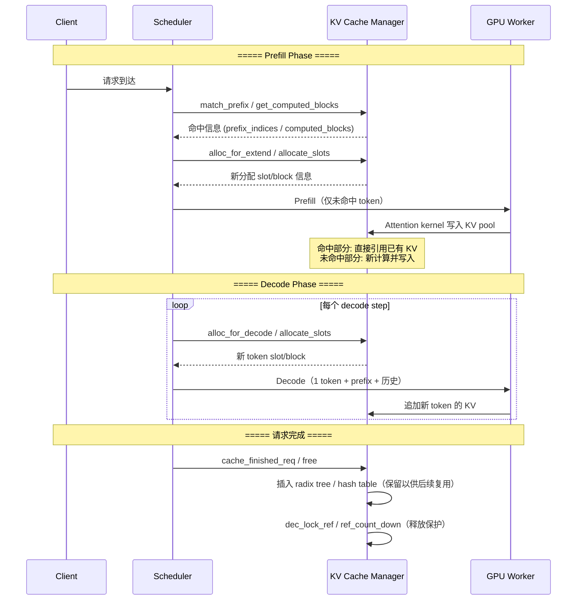
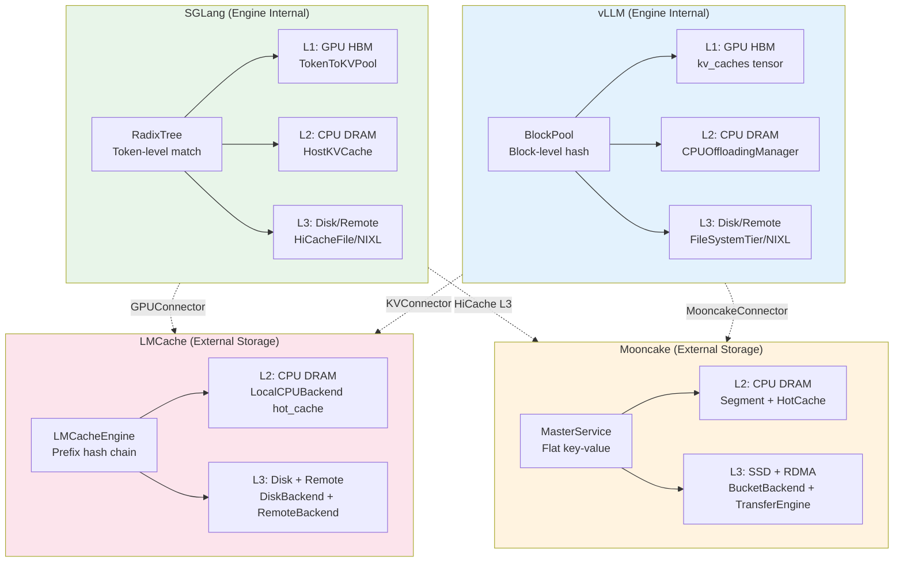

# 四大 Serving 框架 KV Cache 源码分析报告

> 日期：2026-06-12
> 目标：深度对比 SGLang、vLLM、Mooncake、LMCache 的 KV cache 实现，为 AgentKV 系统设计提供参考
> 产出：本文档基于 `notes/sglang_kv_cache.md`、`notes/vllm_kv_cache.md`、`notes/mooncake_kv_cache.md`、`notes/lmcache_kv_cache.md` 四份分析笔记提炼

---

## 1. 各框架 KV cache 架构概述

### 1.1 SGLang：Engine 内部 RadixTree 管理

- **核心抽象**：`RadixCache`（`radix_cache.py`），基于 token-level prefix tree
- **Key**：`RadixKey(token_ids, extra_key)` — child_key 是单个 token id 或 page_size 元组
- **Value**：`TreeNode.value`（int64 tensor，指向 GPU KV pool 索引）、`TreeNode.host_value`（CPU KV pool 索引）
- **层级**：L1 GPU HBM → L2 CPU DRAM → L3 Disk/Remote（通过 HiRadixCache）
- **匹配**：精确 prefix match，O(depth × hash_lookup)，指数搜索+二分搜索
- **引用计数**：`lock_ref` 沿树向上传播，请求持有 `last_node` 的引用

### 1.2 vLLM：Engine 内部 Block Hash Chain 管理

- **核心抽象**：`KVCacheBlock` + `BlockPool`（`block_pool.py`, `kv_cache_utils.py`）
- **Key**：`BlockHashWithGroupId` = SHA256(parent_hash, tokens_i, extra_keys) — 32 字节 block-level hash chain
- **Value**：GPU `kv_caches` tensor，由 `block_id` 索引
- **层级**：GPU HBM → CPU DRAM（CPUOffloadingManager）→ Disk SSD（FileSystemTierManager）→ Remote（ObjectStoreSecondaryTierManager）
- **匹配**：Block-level hash chain 顺序查找，O(num_blocks) 线性扫描
- **引用计数**：`ref_cnt`，Touch 增加、Free 递减，free queue 管理

### 1.3 Mooncake：分布式对象存储 + 传输引擎

- **核心抽象**：`MasterService` + `ClientService`（C++），Object → Replica → AllocatedBuffer
- **Key**：扁平字符串 `ObjectKey` — 无 token prefix 匹配机制
- **Value**：`AllocatedBuffer`（DRAM/SSD/Remote 上的任意字节序列）
- **层级**：CPU DRAM（Segment）→ SSD（BucketStorageBackend/OffsetAllocatorStorageBackend）→ Remote DRAM（RDMA）
- **匹配**：精确 key 匹配，无 prefix 支持；prefix 匹配由上层 HiCache 实现
- **引用计数**：`Replica::refcnt_`（原子）+ Lease/Pin 机制

### 1.4 LMCache：外部 KV 存储层 + 多引擎适配

- **核心抽象**：`LMCacheEngine` + `StorageManager`（`cache_engine.py`, `storage_manager.py`）
- **Key**：`CacheEngineKey(model_name, world_size, worker_id, chunk_hash, dtype)` — prefix hash chain
- **Value**：`MemoryObj`（CPU pinned tensor 或 bytes buffer）
- **层级**：CPU DRAM（LocalCPUBackend）→ Disk SSD（LocalDiskBackend）→ Remote（Redis/Mooncake/S3/InfiniStore 等）
- **匹配**：严格前缀匹配（prefix hash chain 逐 chunk 查找），支持 partial hit
- **引用计数**：`ref_count` + `pin_count`，PinMonitor 防止泄漏

---

## 2. 生命周期对比

### 2.1 总览

| 阶段 | SGLang | vLLM | Mooncake | LMCache |
|------|--------|------|----------|---------|
| **Allocate** | `alloc_for_extend()` 从 TokenToKVPoolAllocator 分配 | `allocate_slots()` 从 BlockPool 分配 | `PutStart()` → MasterService 分配 Segment buffer | `storage_manager.allocate()` 分配 CPU MemoryObj |
| **Prefill 写入** | Attention kernel 写入 KV pool，node.value 指向索引 | Attention kernel 写入 kv_caches[block_id]，通过 slot_mapping 定位 | 客户端通过 TransferSubmitter 写入 DRAM Segment | `gpu_connector.batched_from_gpu()` 从 GPU 拷贝到 CPU |
| **Decode Append** | 每步分配 1 token slot，写入 `req_to_token[req_idx, seq_len]` | 每步分配新 block（或复用未满 block），attention kernel 写入 | 不直接支持 append（Put 是完整替换） | 不直接支持 append（Store 是完整写入） |
| **命中复用** | `match_prefix()` 返回 GPU 索引，跳过已缓存 token 的 prefill | `get_computed_blocks()` touch cached blocks，跳过已缓存 token | `Get(key)` 精确匹配，无 prefix 机制 | `lookup()` 返回命中 token 数，`retrieve()` 加载数据 |
| **Evict/Free** | 最小堆+LRU/优先级，evict 叶子节点，释放 KV pool slots | free queue 顺序驱逐，cached block 优先驱逐 | MasterService eviction，lease timeout，LRU/FIFO 策略 | LRU/LFU/FIFO 策略，allocate 失败时触发驱逐 |
| **Request 结束** | `cache_finished_req()` 插入 radix tree，`dec_lock_ref` 释放保护 | `free()` 逆序释放 blocks，cached blocks 保留在 free queue | PutEnd 完成，lease 续约保持活跃 | `ref_count_down()` 释放，hot_cache 保留 |

### 2.2 请求结束后的 cache 保留

| 框架 | 保留机制 | 保留时长 |
|------|---------|---------|
| SGLang | Radix tree 中 lock_ref=0 的节点保留直到被 LRU 驱逐 | 无 TTL，内存压力驱动 |
| vLLM | Cached blocks 保留在 free queue 尾部，可作为后续 APC 命中源 | 无 TTL，free queue 顺序驱动 |
| Mooncake | Lease 续约 + soft pin（默认 30 分钟 TTL） | 有 TTL，客户端必须 Ping 续约 |
| LMCache | hot_cache 保留，LRU/LFU 驱逐 | 无显式 TTL，内存压力驱动 |

---

## 3. 内存层级对比

### 3.1 各框架支持的层级

| 层级 | SGLang | vLLM | Mooncake | LMCache |
|------|--------|------|----------|---------|
| **GPU HBM** | ✅ 主存储（KV pool） | ✅ 主存储（kv_caches） | ❌ 不直接管理 | ❌ 不直接管理 |
| **CPU DRAM** | ✅ 备份层（host_value） | ✅ Offload 层（CPUOffloadingManager） | ✅ 主存储（Segment + HotCache） | ✅ 主存储（LocalCPUBackend hot_cache） |
| **Disk SSD** | ✅ Storage 后端（HiCacheFile） | ✅ Tiering 层（FileSystemTierManager） | ✅ Storage 后端（BucketStorageBackend） | ✅ Storage 后端（LocalDiskBackend） |
| **Remote Memory** | ✅ NIXL/LMCache 集成 | ✅ Object Store（NIXL agent） | ✅ RDMA（TransferEngine） | ✅ Remote 后端（Redis/Mooncake/S3 等） |
| **GPU Direct Storage** | ✅ GDS（NIXL 插件） | ✅ GdsBackend | ❌ | ✅ GdsBackend |

### 3.2 层级迁移机制

| 迁移路径 | SGLang | vLLM | Mooncake | LMCache |
|---------|--------|------|----------|---------|
| **GPU→CPU** | `write_backup()` DMA，write-through/write-back | `store()` CPUOffloadingManager + CopyBackend | 不适用（不管理 GPU） | `batched_from_gpu()` GPUConnector |
| **CPU→GPU** | `load_back()` DMA | `load()` CPUOffloadingManager + CopyBackend | 不适用 | `batched_to_gpu()` GPUConnector |
| **CPU→Disk** | `write_backup_storage()` 异步 | Store: CPU→FileSystem Tier，级联 | Offload heartbeat 驱动 | `batched_submit_put_task()` 异步 I/O |
| **Disk→CPU** | `prefetch_from_storage()` 异步 | Load: FileSystem→CPU Tier | Load RPC + Transfer Engine | `batched_get_non_blocking()` 异步 |
| **Remote→CPU** | NIXL/LMCache prefetch | NIXL agent load | TransferEngine RDMA read | RemoteBackend get + deserialize |
| **CPU→Remote** | NIXL/LMCache write | NIXL agent store | TransferEngine RDMA write | RemoteBackend put + serialize |

---

## 4. Prefix Reuse 机制对比

### 4.1 核心差异

| 维度 | SGLang RadixCache | vLLM APC | Mooncake Store | LMCache Engine |
|------|-------------------|----------|----------------|----------------|
| **数据结构** | Radix Tree (prefix tree) | Hash table (BlockHash→Block) | 分布式 KV store | Layered dict (Key→MemoryObj) |
| **匹配粒度** | Token-level | Block-level (16 tokens) | Object/Key-level | Chunk-level (256 tokens) |
| **Key 计算** | Tree path: token ID 序列 | Hash chain: H(parent_hash, tokens) | 扁平字符串 | Prefix hash chain: H(parent_hash, chunk_tokens) |
| **部分命中** | ✅ 支持（节点分裂） | ❌ 不支持（只匹配完整 block） | ❌ 不支持（精确 key 匹配） | ✅ 支持（逐 chunk 前缀匹配） |
| **非前缀复用** | ✅ 支持（radix tree 中间节点） | ❌ 不支持（chain 要求严格前缀） | ❌ 不支持 | 部分（CacheBlend 支持 segment 匹配） |
| **Hash collision 风险** | 无（直接比较 token IDs） | 存在（SHA-256，极低概率） | 无（精确字符串匹配） | 存在（依赖 hash 函数） |
| **内存开销** | 较高（tree node 结构） | 低（仅 hash 表） | 中（元数据分片） | 较高（MemoryObj 包装） |
| **查找复杂度** | O(depth) tree traversal | O(num_blocks) 顺序查找 | O(1) hash 查找 | O(num_chunks) 顺序查找 |
| **跨请求复用** | ✅ 同 radix tree | ✅ 同 hash 表 | ✅ 分布式共享 | ✅ 多层后端共享 |
| **跨节点复用** | ✅ Disaggregation/NIXL | ✅ KV Connector | ✅ RDMA 传输 | ✅ Remote 后端 |

### 4.2 SGLang vs vLLM 的本质区别

这是一个关键的设计分叉：

- **vLLM：内容寻址（content-addressed）** — 类似 CDN 的 cache key。Block hash 由 token 内容决定，相同内容产生相同 hash。这意味着 block 只能在 **block 边界** 对齐处复用，不支持 partial block hit。

- **SGLang：结构寻址（structure-addressed）** — 类似文件系统路径查找。RadixTree 的路径由 token ID 序列决定，匹配是精确的 token-level。可以在**任意 token 位置**分裂节点实现 partial hit，天然支持 prefix matching 的各种边界情况。

- **对 Agent 场景的影响**：Agent 的 system prompt 通常不是 block_size 的整数倍。vLLM 的 block-level 粒度会导致尾部不足一个 block 的 KV cache 无法被缓存复用；SGLang 的 token-level 粒度则可以精确匹配到任意位置。

### 4.3 LMCache 的 prefix hash chain

LMCache 采用与 vLLM APC 类似的 prefix hash chain，但粒度是 chunk_size（默认 256 tokens），比 vLLM 的 block_size（默认 16 tokens）更粗。同时 LMCache 的 CacheBlend 机制提供了非前缀匹配的原型（segment 匹配），这是一个值得关注的差异化设计。

---

## 5. 调度器与 KV cache 关系对比

### 5.1 Cache 命中信息传递

| 框架 | 传递方式 | 影响对象 |
|------|---------|---------|
| SGLang | `match_prefix_for_req()` 写入 `req.prefix_indices`、`req.last_node` | PrefillAdder 据此计算 `extend_input_len`，跳过已缓存 token |
| vLLM | `get_computed_blocks()` 返回命中 blocks，`num_computed_tokens` 递增 | Scheduler 据此分配更少 block，prefill 从断点开始 |
| Mooncake | 无内置传递（客户端自行管理） | 依赖上层（HiCache/vLLM connector）处理 |
| LMCache | `lookup()` 返回命中 token 数 | vLLang/SGLang adapter 据此跳过已缓存 token |

### 5.2 调度策略

| 框架 | 策略 | Cache-aware? |
|------|------|-------------|
| SGLang | LPM / DFS-weight / FCFS / LOF / RANDOM / ROUTING_KEY | LPM、DFS-weight 是 cache-aware |
| vLLM | FCFS / PRIORITY | FCFS 不感知 cache；PRIORITY 支持优先级抢占 |
| Mooncake | AllocationStrategy（Random / FreeRatioFirst） | 不感知 KV cache prefix 结构 |
| LMCache | 无独立调度器 | 依赖 serving engine 的调度器 |

### 5.3 Preemption 处理

| 框架 | 方式 | KV cache 处理 |
|------|------|-------------|
| SGLang | 优先级抢占 + retract decode | `cache_finished_req` 插入 radix tree 后释放，重新调度可命中 |
| vLLM | 仅 recompute（v1 不支持 swap） | 释放所有 blocks，`num_computed_tokens=0`，完全重算 |
| Mooncake | Lease 超时自动 evict | 释放 Replica 内存 |
| LMCache | 依赖 engine 的 preemption | adapter 跟踪 preempted 请求状态，支持恢复 |

---

## 6. Session 机制对比

| 特性 | SGLang | vLLM | Mooncake | LMCache |
|------|--------|------|----------|---------|
| **Session 概念** | ✅ SessionController + StreamingSession | ❌ 无 | ❌ 无（仅 lease/pin） | ❌ 无（仅 per-request scope） |
| **跨 turn KV 保持** | ✅ StreamingSession 零 prefill | ❌ 需重新 APC 匹配 | ❌ 需重新 Get | ✅ 需重新 lookup + retrieve |
| **KV 保持代价** | 持续占用 GPU 内存 | 无额外代价（已在 cache） | 无额外代价（已在 store） | 无额外代价（已在 hot_cache） |
| **Session 关闭释放** | ✅ `release_session` 释放 KV | 不适用 | Lease 过期自动释放 | 不适用 |

---

## 7. Engine 内部 vs 外部存储层的边界

这是对 AgentKV 方案选型最关键的分析：

```
┌─────────────────────────────────────────────────────────────────┐
│                   Engine 内部 KV 管理                            │
│  ┌──────────────────┐  ┌──────────────────┐                    │
│  │  SGLang RadixCache│  │  vLLM BlockPool   │                    │
│  │  (GPU + CPU +Disk)│  │  (GPU + Offload)  │                    │
│  │  Token-level match│  │  Block-level match│                    │
│  └────────┬─────────┘  └────────┬─────────┘                    │
│           │                      │                              │
│    GPU KV pool                GPU KV tensor                     │
│    (物理存储)                 (物理存储)                  │
└───────────┼──────────────────────┼──────────────────────────────┘
            │                      │
     GPUConnector           GPUConnector
            │                      │
┌───────────┼──────────────────────┼──────────────────────────────┐
│           ▼                      ▼                              │
│  ┌─────────────────────────────────────────────┐               │
│  │          外部 KV 存储/传输层                     │               │
│  │  ┌─────────────────┐  ┌──────────────────┐   │               │
│  │  │  LMCache Engine  │  │  Mooncake Store  │   │               │
│  │  │  (CPU + Disk +   │  │  (Distributed    │   │               │
│  │  │   Remote)        │  │   DRAM + SSD +   │   │               │
│  │  │  Chunk-level     │  │   RDMA)          │   │               │
│  │  │  Prefix hash     │  │  Object-level    │   │               │
│  │  │                  │  │  Flat key        │   │               │
│  │  └─────────────────┘  └──────────────────┘   │               │
│  └─────────────────────────────────────────────┘               │
└─────────────────────────────────────────────────────────────────┘
```

### 7.1 边界的具体含义

| 层面 | Engine 内部（SGLang/vLLM） | 外部存储（LMCache/Mooncake） |
|------|--------------------------|---------------------------|
| **管理粒度** | Token/Block level | Chunk/Object level |
| **存储格式** | GPU tensor 直接索引 | CPU tensor/bytes 序列化 |
| **匹配算法** | RadixTree / Hash chain | Prefix hash chain / Flat key |
| **跨实例共享** | 不支持（需通过外部层） | 支持（Remote/P2P 后端） |
| **调度感知** | 直接影响 prefill 长度 | 间接影响（lookup → 通知 engine） |
| **内存管理** | GPU 内存池，精细分配 | CPU/Remote 内存池，粗粒度分配 |
| **实时性** | 微秒级匹配 | 毫秒级（网络/IO） |

### 7.2 对 AgentKV 设计的启示

AgentKV 应该站在**哪一层**？有三个选择：

1. **Engine 内部层**（方案 A：扩展 SGLang）
   - 优势：直接控制调度、精细匹配、零延迟
   - 劣势：仅支持单一引擎、不可跨引擎

2. **外部存储层**（方案 C：基于 LMCache 扩展）
   - 优势：跨引擎支持、已有存储基础设施
   - 劣势：间接影响调度、匹配粒度较粗、网络延迟

3. **混合层**（推荐方案）
   - Engine 内部：Agent-Aware Scheduling + Agent Group Aware Eviction
   - 外部存储层：Cross-Session Prefix Pinning + Proactive Prefetch
   - 通过 GPUConnector 接口桥接

---

## 8. Agent 场景差距分析

### 8.1 四框架共性问题

| 问题 | 影响 | 框架现状 |
|------|------|---------|
| **无 Agent Group 概念** | 无法按任务组共享/保护 KV cache | 四框架均无 |
| **无 Agent-Aware 调度** | 同组请求可能被分散调度 | SGLang 有 LPM/DFS（可扩展），其余无 |
| **Prefix 保护不足** | Agent 共享 system prompt 可能被 LRU 驱逐 | SGLang 有 lock_ref（仅单请求），其余 lease/pin |
| **跨 Session KV 共享** | 多角色（planner/coder/reviewer）共享 system prompt | SGLang StreamingSession 仅 1:1，其余无 |
| **Partial Block 复用** | System prompt 不一定是 block_size 整数倍 | 仅 SGLang 支持 token-level |
| **Proactive Prefetch** | 可预测下一步需要的 KV cache | 仅 SGLang HiCache 有部分 prefetch，其余 reactive |
| **组感知驱逐** | 长任务中间 KV 可能被短任务驱逐 | 四框架均无 |

### 8.2 各框架特定差距

**SGLang 特有优势（最适合作为 AgentKV 基础）**：
- Token-level prefix matching → 精确匹配 system prompt 边界
- RadixTree → 天然支持 L0/L1/L2 树状结构
- StreamingSession → 跨 turn 零 prefill 复用
- 多种 cache-aware 调度策略（LPM/DFS）
- HiCache 三级存储架构
- 已有 LMCache/Mooncake 集成路径

**vLLZ 特有差距**：
- Block-level 粒度 → partial block 浪费
- Preemption 只支持 recompute → 长上下文 preempt 代价高
- 无 session 概念
- 需几乎重写 APC 才能支持 token-level 匹配

**Mooncake 特有差距**：
- 无 prefix 匹配 → 完全依赖上层（HiCache）
- 无增量 append → 多轮对话需完整重传
- 分布式延迟 → RDMA 10-100us/MB
- 无 broadcast → 多 agent 串行传输 prefix

**LMCache 特有优势（适合作为跨引擎 KV pool）**：
- 成熟的分层存储架构
- 灵活的存储后端插件系统
- 已有 vLLM + SGLang 适配
- 跨实例复用基础设施
- Blend 机制提供非前缀匹配原型

---

## 9. Mermaid 图

### 9.1 单请求 prefill/decode 下 KV cache 写入与读取流程



### 9.2 四个项目的 KV cache 架构对比图



---

## 10. 设计启示与方案建议

### 10.1 应分别借鉴什么

| 来源 | 借鉴点 | AgentKV 中的应用 |
|------|--------|----------------|
| **SGLang** | RadixTree + Token-level prefix matching | L0/L1/L2 树状管理的基础结构 |
| **SGLang** | LPM/DFS-weight 调度策略 | Agent Group 感知调度的起点 |
| **SGLang** | StreamingSession 跨 turn KV 持久化 | 零 prefill 跨 turn 复用机制 |
| **SGLang** | HiCache 三级存储 + write-through/prefetch | 层级迁移策略和异步预取 |
| **vLLM** | KV Connector 框架（Scheduler+Worker 双端） | 跨节点 KV 传输的架构模式 |
| **vLLM** | 多后端 Offload 级联设计 | 层级间 write-back/提升策略 |
| **Mooncake** | 分布式对象存储 + TransferEngine RDMA | 跨实例 KV cache 共享基础设施 |
| **Mooncake** | Lease/Pin 机制 | 跨 session KV cache 保护策略 |
| **LMCache** | GPUConnector 抽象 | 通用接入多引擎的关键接口 |
| **LMCache** | StorageManager + 多后端插件 | KV pool 的中间层设计 |
| **LMCache** | CacheBlend / Segment 匹配 | 非 prefix 复用的原型参考 |
| **LMCache** | LookupClient/Server 分离 | 远程 lookup 架构 |

### 10.2 推荐方案：混合架构

基于源码分析，我们推荐**方案 A + C 混合**：

**Engine 内部层（方案 A）**：
- 在 SGLang RadixCache 基础上扩展 AgentGroup 抽象
- 实现组感知调度（Agent Group LPM/DFS）
- 实现组感知驱逐（保护共享 prefix 内部节点）
- 扩展 StreamingSession 支持多 session 组内共享

**外部存储层（方案 C）**：
- 参考 LMCache 架构，构建独立的 Agent-Aware KV Cache Pool
- 通过 GPUConnector 接口同时支持 SGLang 和 vLLM 接入
- 增加 Tag-based Key（如 `system_prompt`、`tool_definition`）替代纯 prefix hash
- 增加 Proactive Prefetch（预测 agent 工作流下一步）
- 增加 Session-aware Eviction（同一 agent session 的 cache 优先保留）

**桥接层**：
- SGLang 侧：通过 HiCache + LMCache 集成路径（已有 `lmc_radix_cache.py`）
- vLLM 侧：通过 KVConnector 接口（已有 `lmcache_connector.py`）

### 10.3 预估改动量

| 层面 | 模块 | 改动量 | 复杂度 |
|------|------|--------|--------|
| **Engine 内部** | AgentGroup 抽象 | ~300 行新代码 | 中 |
| **Engine 内部** | schedule_policy.py 扩展 | ~200 行修改 | 中 |
| **Engine 内部** | radix_cache.py 组感知驱逐 | ~300 行修改 | 高 |
| **Engine 内部** | session_controller.py 组管理 | ~100 行修改 | 低 |
| **外部存储** | Tag-based Key 设计 | ~400 行新代码 | 中 |
| **外部存储** | Proactive Prefetch | ~300 行新代码 | 中 |
| **外部存储** | Session-aware Eviction | ~200 行新代码 | 中 |
| **桥接** | SGLang 集成适配 | ~150 行修改 | 低 |
| **桥接** | vLLM 集成适配 | ~200 行修改 | 中 |
| **测试** | 端到端测试 | ~500 行 | 中 |
| **总计** | | **~2650 行** | |

---

## 11. 总结

### 11.1 核心发现

1. **SGLang 的 RadixTree 是目前唯一支持 token-level prefix matching 的框架**，这使其天然适合 agent 场景中 system prompt 不对齐 block_size 的情况。
2. **vLLM 的 block-level APC 在 agent 场景下存在粒度瓶颈**，partial block 不可缓存会导致尾部 token 浪费。要修改几乎需要重写整个 APC 体系。
3. **Mooncake 是纯粹的分布式对象存储**，不理解 KV cache 的内部结构，prefix 匹配需要上层实现。适合作为跨节点传输层，不适合作为 agent-aware 管理层。
4. **LMCache 具有最成熟的分层存储和跨引擎适配架构**，其 GPUConnector 抽象是通用接入的关键接口。但 prefix hash chain 的严格匹配限制了对 agent 多轮对话中间段 KV 的复用。

### 11.2 关键决策点

1. **匹配粒度**：AgentKV 应采用 token-level 还是 chunk-level？
   - 建议：SGLang 扩展用 token-level；LMCache pool 用 chunk-level（兼容 vLLM）
2. **跨引擎接入**：如何同时支持 SGLang 和 vLLM？
   - 建议：LMCache 的 GPUConnector 抽象 + 扩展 Tag-based Key
3. **调度层**：agent-aware 调度放在哪里？
   - 建议：SGLang 内部扩展（直接影响 prefill），LMCache pool 侧做辅助调度
4. **驱逐策略**：如何保护共享 prefix？
   - 建议：引用计数 + agent group scope，而非简单的 LRU

---

## 参考

- `notes/sglang_kv_cache.md` — SGLang 完整分析（824 行）
- `notes/vllm_kv_cache.md` — vLLM 完整分析（844 行）
- `notes/mooncake_kv_cache.md` — Mooncake 完整分析（785 行）
- `notes/lmcache_kv_cache.md` — LMCache 完整分析（935 行）
- `docs/13_kv_cache_file_index.md` — 关键文件索引
- `docs/11_precise_lcp_calculation.md` — LCP 精确计算数据
- `docs/10_L0_L1_decomposition.md` — L0/L1/L2 分解
