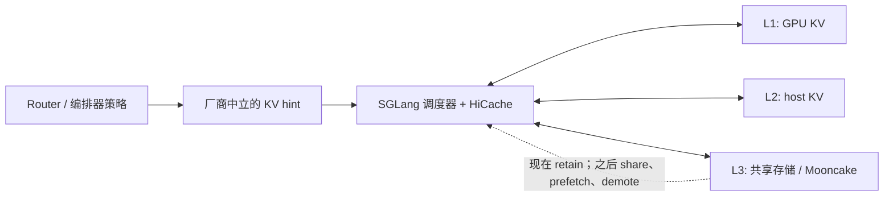
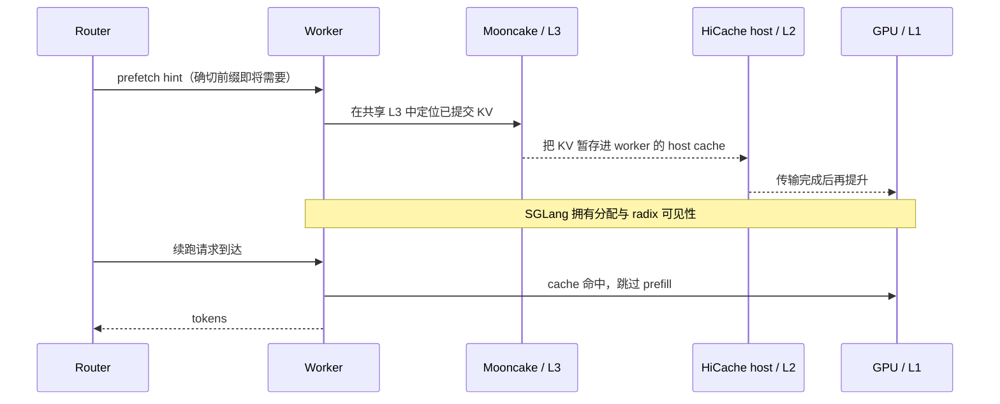
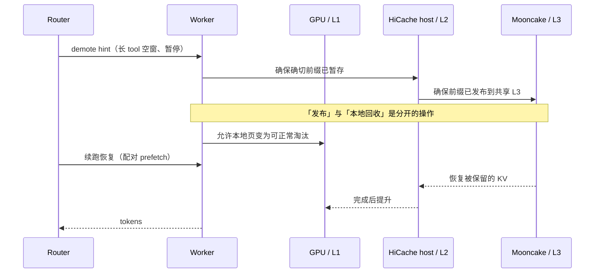
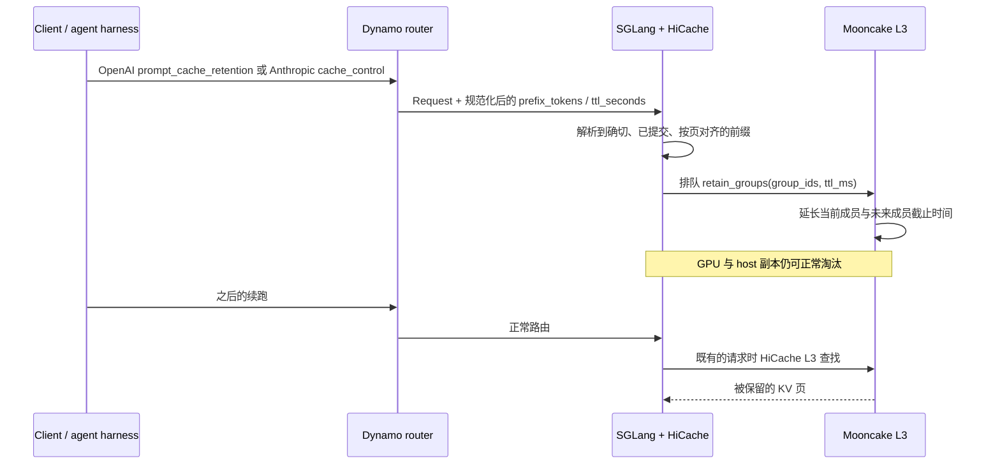

# SGLang #27574 完整中文翻译：面向 Agentic 工作负载的可编程 KV Cache

> **原文**：[sgl-project/sglang#27574](https://github.com/sgl-project/sglang/issues/27574) — RFC: Programmatic KV Cache for Agentic Workloads  
> **作者**：@ishandhanani, @hzh0425  
> **状态**：Open；标签 high priority；指派 @xiezhq-hermann / @hzh0425 / @ishandhanani  
> **创建**：2026-06-08；**正文更新**：约 2026-07-10  
> **本文性质**：RFC 正文的完整中文翻译（保留原文结构、链接与图），文首加「在做什么」导读；文末附关键讨论摘译。  
> **关联**：`docs/30_agentic_serving_request_surface_survey.md`（该 RFC 在「路径 A：router/orchestrator 声明」中的位置）
>
> **状态核验更新（2026-07-16）**：不要把 RFC 路线图中的“已实现 POC / 进行中”误读为正式发布。以 GitHub PR API、SGLang `v0.5.15.post1` release 源码和 flags 交叉核验：`#27058`（SessionRadixCache）与 `#29436`（top-level `session_id`）已合并并发布；`#21045`（priority + retention duration）关闭且未合并；`#29173`（session/ref-aware eviction）与 `#30796`（KvHintEnvelope/L3 retain）仍开放；`#24656`、`#27574`、`#29099`、`#29709` 等主要 RFC/Issue 仍开放。新的研究基线与 residual-utility 判断见 [`docs/33_explicit_session_prefix_family_plan.md`](33_explicit_session_prefix_family_plan.md)。

---

## 状态矩阵：正式能力、研究基线与提案

| 项目 | 2026-07-16 状态 | 在本研究中的用法 |
|---|---|---|
| `#27058` SessionRadixCache | 已合并、已发布 | 正式机制与必须超过的基线 |
| `#29436` top-level `session_id` | 已合并、已发布 | 显式 Session 身份入口 |
| `#21045` priority + retention duration | 已关闭、未合并 | 历史设计，不得写成现有能力 |
| `#29173` session/ref-aware eviction | 开放 PR | strongest research baseline，离线等价实现 |
| `#30796` KvHintEnvelope / L3 retain | 开放 Draft PR | F0 通过后的潜在接口，不是当前依赖 |
| `#24656` agent-aware KV | 开放 RFC/Issue | 相关提案 |
| `#27574` programmatic KV hints | 开放 RFC/Issue | 本文翻译对象，不是正式能力 |
| `#29099` SessionRadix/HiCache follow-up | 开放 RFC/Issue | 后续依赖/讨论 |
| `#29709` agentic KV follow-up | 开放 RFC/Issue | 后续提案 |

这里的“已发布”只表示代码进入所核验的正式版本，不表示其默认启用，也不表示开放 RFC 中描述的所有后续阶段已经完成。

---

## 导读：这个 Issue 在做什么（非原文）

一句话：**让引擎外的 Router/编排器，用一套窄的、可拒绝的「KV 提示（hints）」告诉 SGLang「哪些 KV 该共享 / 预取 / 降级 / 有界钉住」，而不让编排器直接操盘调度器与内存。**

| 要点 | 内容 |
|------|------|
| 问题 | Agent 轨迹上，KV 的真实价值（会不会复用、tool 空窗长短）在引擎之上是可知的，但引擎内只有 request-local LRU（块哈希 + 引用计数） |
| 方案 | Router 下发 provider-neutral 的 `KvHintEnvelope`；SGLang + HiCache 负责落到精确 radix/页组；L3（如 Mooncake）做跨 worker 保留与搬迁 |
| 与 session | Phase 1 补一等公民 `session_id` + session radix tag；Pin POC **刻意可只按 token 前缀、不强制 session** |
| 与 #24656 | #24656 = 单引擎、client 塞 `agent_hints`；本 RFC = 多引擎、**router 发起**；二者可组合 |
| 非目标 | 不是给终端用户的公开 Cache API；不是保证服从 hint；不是取代 LRU/本地前缀匹配 |

下文从「Introduction」起均为 RFC 正文翻译。

---

# RFC：面向 Agentic 工作负载的可编程 KV Cache

作者：@ishandhanani, @hzh0425

## 引言

> **说明**：在本 RFC 中，「router」指位于多个引擎单元之上的编排器（orchestrator）。

Agent 工作负载使得某个 KV 块的价值可以从引擎「之上」被预测，但这种价值对「请求本地的 LRU」是不可见的。我们提议暴露一个**窄的、由 router 发起的 hint 界面**，让外部 router 把缓存意图传给 SGLang，而**不必侵入式地改写**引擎调度器与 cache manager。这样，SGLang **仍保有调度与内存的所有权**，并能对任意 hint 进行裁剪、推迟或拒绝。

今天，引擎能识别「什么内容已被缓存」以及「本地驻留在哪一层」，但不知道：一条轨迹**为什么**会复用某段前缀，或外部工具 / 子 agent 的空窗会持续多久。**Session 归属**对「按生命周期定策略」有用，但并非寻址 KV 的唯一方式：请求级 hint 可以在 tokenize 之后精确点名一段 token 前缀。

[#27058](https://github.com/sgl-project/sglang/pull/27058) 的 session 工作与此**互补**：当策略确实按 session 作用域时，它让引擎把 radix 所有权关联到 session。下文描述的首个 **L3 Pin POC 有意设计成相对 token（token-relative）**，**不要求** session 身份。

依托如下进行中的工作，例如：

1. [sglang#20535](https://github.com/sgl-project/sglang/pull/20535) — 允许 HiCache 进入 buffer 模式，让节点上的 L3 缓存占用更多空间。Buffer 模式并非严格必需，但「给 L3 更多内存」的想法在此有用。  
2. [Mooncake#2214](https://github.com/kvcache-ai/Mooncake/pull/2214) — 允许 Mooncake（MC）开始发送 KV 事件，供 indexer 使用。

我们可以把 **L3 缓存**当作共享的「保留与搬迁」基底。**Router 表达意图**；**SGLang** 将该意图解析到精确的 radix 内容上，并继续负责分配、传输完成与可见性；**存储后端**拥有已存对象的生命周期。



hint 界面比任何单一后端操作都更广。目前已落实并验证的一条映射是：**有界的 Pin 意图 → Mooncake L3 租约（lease）**——但不把该机制当成整个 RFC 的全部。

## 高层路线图（可能变更）

### Phase 1 — 基于 session 的 KV cache

1. [sglang#29436](https://github.com/sgl-project/sglang/pull/29436) — 启用顶层一等公民 `session_id`，从而不必劫持 `session_params.session_id`（后者被 `StreamingSession` 缓存使用）。  
2. [sglang#27058](https://github.com/sgl-project/sglang/pull/27058) — 使 `session_id` 能打进 KV 块的 tag，从而可按 session 级别引用 KV。  
3. **TODO** — 在 HiCache 层实现 `SessionRadixCache`。

### Phase 2 — 设计由 router 发起的 hint API

1. **已实现 POC / PR 进行中** — 将厂商中立的 `KvHintEnvelope` 从外部编排器经请求预处理带入 SGLang 引擎。  
2. **已实现 POC / PR 进行中** — 将有界 Pin 意图映射到精确的、已提交的 HiCache 页组，以及 Mooncake L3 的 TTL 租约。  
3. **TODO** — 将 L3 Pin 在准入、遥测、过期、命名空间、版本偏差等方面生产化。  
4. **TODO** — 先度量「请求时 L3 回填（restoration）」效果，再加入主动的 Prefetch / Demote 执行 API。

## 问题陈述

编排器知道请求本地策略所不能知道的结构信息：哪些 session 仍存活；哪些 token 区间是共享前缀、哪些是独有尾巴；tool 空窗是 10ms 还是 10 分钟；某个子 agent 何时打开、何时关闭。**引擎只看见块哈希和引用计数。**

当前形态：

```text
请求到达
  -> router 按 KV overlap / 负载选择目标 worker
  -> 目标 worker 检查本地 cache
       命中:  复用
       未命中: 重算，或执行本地 offload 策略
```

在下列情况这不够用：

- 另一台 worker **已经持有**该前缀；  
- 工作负载知道请求**很快会恢复**；  
- session **已结束**，其 KV 应降级 / 释放；  
- 编排器想保护**高价值** KV；  
- 或本地策略**分不清**短 tool 空窗与长空窗。

缺少的抽象是：一个**精确、可观测**的界面，让编排器**偏置（bias）** cache manager，却**不拥有**调度器与内存内部实现。让外部系统直接操纵 cache 内部是错误设计：脆弱、在引擎外重复调度策略，并迫使重划 scheduler / cache-manager 边界。**Hints 把所有权留在 SGLang 内**，并让编排器在请求边界与生命周期边界上做软性影响。

---

## 设计原则

1. **编排器拥有策略；引擎执行。** Agent 图 / workflow 智能在引擎外。引擎只理解优先级、TTL、session 归属、层级——**理解「做什么」，不理解「为什么」。** 以保持简单。  
2. **未使用时零开销。** 不带 hint 的工作负载行为与今天完全一致。  
3. **Hints 是软的、有界的、可安全拒绝的。** 引擎可接受、裁剪、推迟或忽略。每条 hint 可观测。客户端**不能**无界 pin 内存或卡死调度器。  
4. **默认由 Router 发起。** 工作负载仍可发出意图，但 **router** 才是把「工作负载上下文」与「全局 KV 布局、worker 负载、健康、准入」合并的地方。生产环境中，router 通常有：来自事件的全局 KV 索引、内建 HA/容错、已有的 overlap/负载路由 + 准入控制，以及（借助 harness ↔ orchestrator 工作）**轨迹级意识**，而不只是请求级意识。

---

## Hint 分类（概念层）

### Share（共享）

复用已在**另一 worker** 或**共享层**上的前缀：把续跑路由到负载更轻的 worker，但从旧 worker 拉前缀；在兄弟子 agent 之间共享公共前缀；给扩容上来的新 worker 预热。这是整套模型的**存在性证明**：在 workers 之间原生搬迁 KV 的机制，也是其他 hint 所需要的。可用 L3 实现。

### Prefetch（预取）

在**需要之前**把 KV 搬到更热层：为很可能的下一轮前缀预热 GPU；把共享 KV 拉进新选中的 worker；在子 agent 关闭期间把主 agent 的 KV 重新装回。在拿到 Share hint 所需的 API 之后，这项较易启用。



### Demote（降级）

把 KV **搬到更冷层**而不是直接丢掉：很长的外部 tool 调用、暂停的轨迹、低优先级但仍可复用的子 agent 状态、重算昂贵时的内存压力。Demote 与 Prefetch/Onboard 成对出现——暂停时卸下的 KV，正是续跑前要预热回来的 KV。在拿到 Share hint 所需 API 之后较易启用。



### Pin（钉住）

在**有界 TTL** 内，使高价值前缀免于普通淘汰。例子：昂贵的检索上下文、共享 planner 状态、以及重算主导延迟的 tool/子 agent 空窗。Pin **不意味着**永久占满 HBM：引擎可以在更冷层实现「钉住」，同时让 L1/L2 副本仍可正常淘汰。

首个实现 POC 在 **Mooncake L3** 上落地 Pin：



- [Mooncake#2835](https://github.com/kvcache-ai/Mooncake/pull/2835) 增加有 TTL 边界的 `retain_groups`、自动过期、未来成员继承、以及有界的 group 准入。  
- Dynamo 把厂商原生控件规范化为小的 `KvHintEnvelope`；SGLang 把 token 偏移解析为精确 HiCache 页组，并在既有 storage worker 上排队 Mooncake 元数据操作。  
- 一次 MiniMax M2.7 + H100 的 A/B：压力下驱逐了 24.18 GB / 95,232 keys。**未 retain** 的冷 worker 探测重算了 10,032 tokens；**一小时 retain** 的探测从 L3 恢复了 10,016 tokens，只新算了 16。  
- 这是「低挂果实」，可用于实现 Anthropic 的 `cache_control` API 与 OpenAI 的 `prompt_cache` API。

实现侧使用 “retention” 一词，因为这是厂商 API 语言；在本分类中它等于**有界的 L3 Pin**。下方的 **Retain** 概念则是**按优先级偏置淘汰**，而非带保证的租约保护。

### Retain（偏置保留）

在必须淘汰时**偏置淘汰顺序**，而不是用租约保护前缀：某些 token 区间比另一些更「值得留下」。编排器给一个 token 区间附相对优先级（可选带时长）；内存压力下引擎先驱逐低优先级 KV。已有 `priority` radix-cache 策略可支撑，并可仿 TensorRT-LLM 的 `TokenRetentionConfig` 补上 duration 语义。

---

## 非目标（Non-Goals）

- **不是**面向终端用户的公开 cache API；**生产者是 router/编排器**。  
- **不是**编排器直接操纵 cache-manager 内部；hints 只偏置。  
- **不是**取代本地前缀匹配或 SGLang 的 LRU——它增强并重排它们。  
- **不保证**引擎服从任意 hint；始终允许 accept / clip / defer / reject。  
- **不承诺**冻结当前 POC schema。`KvHintEnvelope { retention: [{prefix_tokens, ttl_seconds}] }` 是第一个被跑通的形状，**不是**最终分类学。

---

## 与现有 SGLang 工作的关系

本 RFC 与两项进行中的 SGLang 工作**互补**；它从**不同角度**攻击同一个 agentic-KV 问题：**多引擎之上的 router**，而不是单引擎内部。

- **[#24656](https://github.com/sgl-project/sglang/issues/24656) — Agent-Aware KV Cache（Phase 1）** 是 ***引擎内、由 client 驱动*** 的角度：OpenAI 请求上可选的 `agent_hints` 流入单个引擎，标注 radix 节点，并喂给实验性 `agent_aware` 淘汰策略。本 RFC 是同一意图的 ***由 router 发起、多引擎*** 角度，二者可组合：#24656 的 `agent_hints` 是自然的请求级信封，其 `cache_ttl_ms` / `reuse_hint` 正好对应我们的 Pin / Retain。本 RFC 再补上 #24656 明确推迟的 **带外控制路径** 与 **跨 worker 的 KV 搬迁**（Share / Prefetch / Demote：HiCache/存储元数据继承、跨进程协调）。  
- **[#21846](https://github.com/sgl-project/sglang/issues/21846) — Distributed KVCache System for Agentic Workload** 是 ***机制 / 底座***：HiCache 分层、PD 增量传输、存储 prefetch 接口、混合模型支持。本 RFC 是跑在这些铁轨上的 ***策略层***——Share 用 worker 间 HiCache 搬迁，Prefetch 映射到路线图中的存储 prefetch 接口，Demote 映射到多层 offload。#21846 建管道；**router 决定何时用**。其自身的 “Agent/Rollout KVCache Management” 也指向 #24656，因此三者是**同一条弧线**。

---

## 参考文献

**外部 RFC / API、研究，以及我们既往工作**

### 外部 RFC / API

- vLLM #37003 — Context-Aware KV-Cache Retention API（优先级淘汰）；（实现 PR #38514）  
- vLLM #37168 — 长运行 Agent 的主动协调与两区调度；（实现 vllm-ascend#6722）  
- vLLM agentic-api #18 — Session-aware KV cache management  
- vLLM #39305 — Selective KV Cache offload；（实现 PR #39983）  
- vLLM #38260 — 经 offloading connector 的多层 KV offload  
- TensorRT-LLM `KvCacheRetentionConfig` / `TokenRangeRetentionConfig`（token_start/token_end/priority 0–100/duration_ms；默认 35；decode_retention_priority；secondaryOffloadMinPriority）

### 研究

- KVCache in the Wild（阿里 trace）：https://arxiv.org/abs/2506.02634  
- Continuum（多轮 agent 的 KV TTL）：https://arxiv.org/abs/2511.02230  
- Tail-Optimized Caching for LLM Inference：https://arxiv.org/abs/2510.15152  
- KVFlow（workflow-aware 前缀缓存）：https://arxiv.org/abs/2507.07400  
- MARCONI（混合 LLM 的前缀缓存）：https://arxiv.org/abs/2411.19379

### 我们既往工作（sglang / Mooncake）

- #24656（agent-aware KV phase 1 / API 反馈）、#21846（分布式 KV 路线图）、#27058（radix 原生 session）、#27024 / #27025（streaming-session 死锁 + 边界）、#22273 / #21875（streaming-session 泄漏修复）、#18941（TTL 前缀 pinning）、#21045（priority retention duration）、[Mooncake#2214](https://github.com/kvcache-ai/Mooncake/pull/2214)（group 语义）、[Mooncake#2835](https://github.com/kvcache-ai/Mooncake/pull/2835)（有 TTL 边界的 group retention POC）。

### 我们既往工作（dynamo）

- [#7665](https://github.com/ai-dynamo/dynamo/pull/7665) / [#7377](https://github.com/ai-dynamo/dynamo/pull/7377) / [#7384](https://github.com/ai-dynamo/dynamo/pull/7384)（session_control + ephemeral KV 路由）、pi-dynamo-provider#4（per-subagent sessions）、[#6213](https://github.com/ai-dynamo/dynamo/pull/6213) / [#6571](https://github.com/ai-dynamo/dynamo/pull/6571)（Anthropic 风格 cache_control）、[#8789](https://github.com/ai-dynamo/dynamo/pull/8789) / [#9140](https://github.com/ai-dynamo/dynamo/pull/9140)（agent_context / ATIF）、[#9448](https://github.com/ai-dynamo/dynamo/pull/9448)（thunderagent_router program scheduler）。

---

## 附录 A：关键讨论摘译（非 RFC 正文）

选取与设计选择直接相关的评论；求职/自发项目推销略压缩。

### A.1 为什么用 hints，而不是在引擎内做更智能的淘汰？

**@limarkdcunha（2026-06-11）**  
核心设计选择上好奇：为什么走 hints，而不是直接在引擎内做更智能的淘汰（例如引用的 KVFlow、Continuum）？假设是否是「编排器总比引擎本地推断更懂上下文」，还是 hints 只是通向更自治系统的垫脚石？

**@ishandhanani（作者回复）**  
**两条路可以同时走！** 大规模时，多人在编排器后面跑多台 SGLang。我们需要引擎本地的更聪明调度与淘汰研究；同时，借助 harness ↔ orchestrator（例如 ThunderAgent 的 `program_id`，或 Dynamo 的 `agent_context`），可以从编排器视角做**轨迹级**更高层决策。

### A.2 轨迹级准入 / 防抖动（贡献者经验）

**@Zhangmj0621（2026-06-15）**  
在 SGLang 上做过类似能力，吞吐提升明显。认同引入不同淘汰策略（其实现里叫 eviction priority）。观察：**仅 workflow/trajectory-aware 淘汰不够**——多轮变长时容量仍会成为瓶颈，请求互相驱逐、反复重算。做法借鉴 CONCUR：KV 压力高时**主动控 batch size**，即使某请求本可挤掉 in-flight 多轮轨迹的 KV，也不让它进 batch。压力高到必须驱逐未完成轨迹时，**按轨迹级而非 token 级**驱逐，进一步提升并接近线性扩吞吐；论文即将发表。愿协作。

**@ishandhanani**  
是否类似 ThunderAgent（主动控制 running trajectories 防 thrashing）？请分享 RFC；并请看 [#27058](https://github.com/sgl-project/sglang/pull/27058)。

**@Zhangmj0621**  
与 ThunderAgent 有相似处，但 ThunderAgent 依赖若干硬阈值，不宜原样做成 SGLang 通用能力；愿在 `#agent-inference` 继续讨论。

### A.3 Dynamo conversation-aware 不均衡

**@YAMY1234（2026-06-29）** — [评论链接](https://github.com/sgl-project/sglang/issues/27574#issuecomment-4828891106)  
早该看到该计划。最近在看 Dynamo + conversation-aware 在 agentic-perf 中的**不均衡**；本提案多出的信息与指标对改善 balancing 会很有帮助。

### A.4 后续落地 PR（时间线摘录）

| 日期 | 事件 |
|------|------|
| 2026-06-08 | Issue 创建；挂到 #21846；关联 #27058 |
| 2026-06-15 | 建 Slack 频道 `#agent-inference` |
| 2026-06-24 | 关联 [#29099 Session-level Cache Preemption](https://github.com/sgl-project/sglang/issues/29099) |
| 2026-07-10 | 关联 Mooncake [#2835](https://github.com/kvcache-ai/Mooncake/pull/2835)、SGLang [#30796](https://github.com/sgl-project/sglang/pull/30796)（hinted prompt KV retain 到 Mooncake L3）、Dynamo [#11534](https://github.com/ai-dynamo/dynamo/pull/11534)（normalize prompt cache retention → KV hints） |
| 2026-07-12 | 关联 [#30928 Position-Independent KV Reuse](https://github.com/sgl-project/sglang/issues/30928) |

---

## 附录 B：与我们文档立场的对照（非原文）

| 本 RFC | `docs/29` / `docs/30` |
|--------|----------------------|
| 策略在 **router/orchestrator**；默认假设上层**已知** session / 轨迹 / tool gap | 主路径：**serving 从匿名 Chat payload 推断** session/family |
| Phase 1 仍要 **一等公民 `session_id`**（client/router 提供） | 显式 id 作上界对照，不作为零先验主声明 |
| Pin 可用 provider 原生 `cache_control` / `prompt_cache_retention` 规范化而来 | 真实主流 agent 多数仍不填这些字段（见 doc 29 §5.15） |
| 工程价值：可做异构多机 KV 搬迁与有界 L3 租约 | 论文差异化：hints **不存在**时如何推断，并可**可选地写出**等价 hint 供本 RFC 这类策略层消费 |

---

## 修订记录

| 日期 | 内容 |
|------|------|
| 2026-07-14 | 初稿：#27574 RFC 正文完整中译 + 关键评论摘译 + 与 doc 29/30 对照 |
