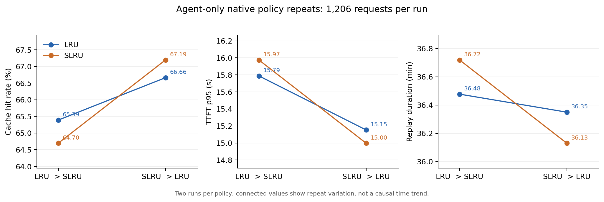

# 原生 LRU / SLRU 顺序互换复验

日期：2026-10-08。四次 GPU 运行均已完整结束，实验服务和 GPU 占用已释放。本报告更新 [2026-10-07 三策略单次分析](传统淘汰策略三策略实验与原因分析_20261007.md) 中对 SLRU 的候选判断；本次未重新运行 LFU。

## 结论

**SLRU 相对 LRU 的小幅优势没有稳定复现，当前保留 LRU 为主基线更合适。** 第一批 SLRU 少命中 338,688 token（−0.6942 个百分点），反向批次多命中 259,328 token（+0.5315 个百分点）。两次运行的平均命中率是 LRU 66.0260%、SLRU 65.9446%，SLRU 平均少命中 39,680 token，差异为 −0.0813 个百分点。

两种策略的平均总回放时间几乎相同，SLRU 的 TTFT p95 也没有平均优势。每种策略只有两次重复，这些数字描述本次观测，不能据此声称统计显著、证明 LRU 普遍更好，或认定先后顺序是唯一原因。

**实验确实有缓存压力，不能把收益小解释成“容量过于宽裕”。** Full/SWA 占用 p95 分别约为 99.9% / 99.5%，并且四次都观察到大量原生回收。下一步应定位两种策略共同存在的前缀缺口和真实回收机制，再决定新策略应改变什么。

## 实验边界与完整性

| 项目 | 本次设置 |
|---|---|
| 流量 | 纯 Agent，20 个完整 session，1,206 请求/次 |
| 输入 / 输出 | 每次 48,787,785 / 693,217 token |
| 引擎 / 后端 | 隔离 SGLang 0.5.13.post1 / UnifiedRadixCache |
| Full / SWA 容量 | 524,288 / 52,224 token |
| 页大小 / 最大运行请求数 | 256 / 8 |
| 回放规则 | 冻结输入、输出长度、会话依赖和等待规则；时间缩放 0.30 |
| 执行顺序 | 第一批 LRU → SLRU，第二批 SLRU → LRU |
| 策略语义 | 原生默认参数；SLRU 门槛为 `hit_count >= 2`，没有独立 protected 段配额 |
| 实际策略覆盖 | 所选评分器作用于 Full；SWA 回收仍走原生 LRU，可能耦合释放 |
| 分类器 / 业务分区 | 本次均未接入 |

这里比较的是锁定原生实现中的策略选项。它不能代替“Full/SWA 两条回收路径都采用统一新机制”的验证，也不是动态分区收益实验。

四次合计完成 **4,824 个请求**，协议、输入与输出完整性、空缓存起点、实际配置一致性和服务释放审计通过；0 retraction、0 monitor error。每次两轮固定形状预热都完整完成。四次核心测量脚本哈希相同；有效配置与原放行配置一致，只有模型路径发生了已记录的迁移。

旧 `/inspire/...` 挂载不可用，使用公共缓存中的 DeepSeek-V4-Flash 快照 `fd53f944496234770ba80e15004f9b6d269a71f5`。元数据哈希、46 个权重分片数量和总大小 159,617,149,040 字节与环境锁一致；本次没有重新计算全部权重分片的内容 SHA256，不将分片数量和大小检查称为完整权重字节校验。

## 四次有效结果

| 批次与位置 | 策略 | 命中率 | TTFT p50 / p95（秒） | 请求耗时 p50 / p95（秒） | 回放时间（分钟） |
|---|---|---:|---:|---:|---:|
| 第一批，第 1 次 | LRU | 65.3903% | 0.471 / 15.788 | 7.471 / 45.213 | 36.477 |
| 第一批，第 2 次 | SLRU | 64.6961% | 0.534 / 15.975 | 7.837 / 43.939 | 36.719 |
| 第二批，第 1 次 | SLRU | 67.1932% | 0.409 / 14.998 | 7.024 / 42.733 | 36.130 |
| 第二批，第 2 次 | LRU | 66.6617% | 0.392 / 15.153 | 7.358 / 42.759 | 36.349 |

| 两次运行的均值 | LRU | SLRU | SLRU 相对变化 |
|---|---:|---:|---:|
| 命中率 | 66.0260% | 65.9446% | −0.0813 个百分点 |
| 未缓存输入 token / 次 | 16,575,177 | 16,614,857 | +0.2394% |
| TTFT 均值（秒） | 4.7272 | 4.6847 | −0.9004% |
| TTFT p95（秒） | 15.4704 | 15.4863 | +0.1023% |
| 请求耗时均值（秒） | 13.8786 | 13.8455 | −0.2383% |
| 请求耗时 p95（秒） | 43.9862 | 43.3357 | −1.4788% |
| 总回放时间（秒） | 2,184.7894 | 2,185.4560 | +0.0305% |

上表 p95 是两次运行各自 p95 的平均值，未把请求合并后重新取分位数。未缓存输入包含必要的新内容，不等于全部是可避免的重算。



独立图文件：[PNG](figures/order_balanced_20261008/comparison.png)、[SVG](figures/order_balanced_20261008/comparison.svg)。

## 差异为什么不能解释成稳定策略优势

同一策略重复时，LRU 命中率变化 **1.2714 个百分点**，SLRU 变化 **2.4971 个百分点**；均超过两批内 LRU/SLRU 的差距。LRU 两次运行有 200 个请求命中量不同，SLRU 有 190 个。

逐请求对齐后，两批内 SLRU 分别有 90 / 95 个请求多命中、97 / 91 个少命中，其余约 1,020 个相同。第一批正向收益 1,093,120 token 被 1,431,808 token 的负向变化抵消；第二批正向收益 1,097,472 token、负向变化 838,144 token。两批结果没有形成一致的净收益。

两次比较中都由 SLRU 多命中的请求只有 22 个，都少命中的有 24 个，胜负符号翻转的有 29 个；若要求两次都至少相差 8K，多命中 / 少命中的请求分别是 7 / 2 个。这些是下一步可复查的窗口，不能据此直接证明当时存在更好的合法驱逐选择。

| session 片段 / 任务 | 第一批 SLRU − LRU（token） | 第二批 SLRU − LRU（token） |
|---|---:|---:|
| `0bb81a9c` / drone-planning-control | +77,312 | +62,720 |
| `adff36a1` / invoice-fraud-detection | +25,344 | +69,888 |
| `644eacbc` / quantum-numerical-simulation | −47,616 | −56,576 |
| `7fddbb09` / shock-analysis-demand | −155,136 | +61,696 |
| `8e000b0a` / fix-erlang-ssh-cve | +75,520 | −58,880 |

固定的是请求内容与会话依赖，下一轮实际到达仍取决于上一轮何时完成。两批策略比较中分别有 **912 / 908** 个请求的全局提交排名不同；同一 LRU 的两次运行也有 994 个不同。这个变化证明缓存状态面对的竞争顺序不完全相同，但不能单独证明全部差异由交错造成。

本次没有完整候选、victim、split、lock 和分池回收事件，所以仍不能把单请求胜负升级为同一缓存状态下的因果对照。

## 共同问题：有压力，有可驱逐缓存，仍有大量前缀缺口

四次运行的 Full 占用 p95 为 99.90%–99.95%，SWA 均为 99.51%。Full 不可驱逐占用 p50 约为容量的 46%–47%，可驱逐占用 p50 约为 47%–48%；SWA 可驱逐占用 p50 约为 82%–83%。这些是分别统计的分位数，不能直接相加，也不能将可驱逐总量当成某次回收的合法叶候选集合。

| 运行 | 原生 `evicted_tokens_total` 增量 | 原生回收调用计数增量 | 原生回收耗时累计增量（秒） |
|---|---:|---:|---:|
| 第一批 LRU | 160,870,400 | 27,896 | 506.964 |
| 第一批 SLRU | 169,326,592 | 28,704 | 523.617 |
| 第二批 SLRU | 157,259,776 | 27,512 | 498.547 |
| 第二批 LRU | 156,872,704 | 27,400 | 515.073 |

这是原生计数器的原始增量，可能混合 Full/SWA 和 TP 副本；不除以 8 推算逻辑 token，也不把累计回收耗时当成服务墙钟时间。

用 `max(0, 页对齐的相邻输入 LCP − 当前 cached_tokens)` 统计内容缺口代理，四次运行总量为 13,477,632–14,695,936 token。**363/1,206（30.10%）个请求在四次运行中都至少有 8K 缺口**；逐请求取四次最小缺口后再求和仍有 **12,200,960 token**。

这说明大量缺口在两种排序下反复出现，应该优先定位共同机制。它并不证明这些缺口全部可避免，更不能归因给某个池、某个 victim 或某个具体策略错误；缺少物理事件时，始终保留“相邻前缀缺口代理”的名称。

## 时间收益为什么仍小

两种策略的平均命中量几乎相同，未缓存输入量只差约 0.24%，本次没有足够大的净减少来期待明显时间加速。

原生 TP0 调度排队直方图完整覆盖每次 1,206 个请求，四次平均排队分别为 3.9502、3.9642、3.8245、3.9231 秒，而对应客户端 TTFT 均值约为 4.59–4.78 秒。按均值量级比较，排队约占 TTFT 的 **83%**。所以 TTFT 不是纯 prefill 计时，缓存选择、排队和会话交错必须一起解释。

TTFT 减去排队均值后剩余约 0.77–0.81 秒，仍混合 prefill、首 token 生成、客户端/服务端开销，不能标成精确 prefill。请求完成时间还包含后续生成，缓存命中率也不直接决定最后一个会话何时结束。

四次测量窗口中都记录到 13 条 DeepGEMM JIT 预编译提示，说明固定形状预热没有消除所有形状的运行时准备。次数相同不等于开销相同；本次没有用日志次数伪造精确编译耗时或精确 prefill 分解。原生响应里的 `queue_time` 存在此前已确认的序列化问题，因此这里使用经过覆盖校验的调度直方图。

## 下一步建议

1. **固定 LRU 主基线，保留 SLRU 对照。** 目前没有依据把 SLRU 升级成默认 Agent 区策略；LFU 的旧单次结果和高回收开销可作为线索，本轮未复验其稳定性。
2. **先诊断可重复窗口和共有缺口。** 选上述稳定正负案例与至少一组四次共同缺口，记录 Full/SWA 的请求匹配、合法候选、锁定、实际释放和后续回访。分池记录是为了识别物理约束，后续机制设计仍应保持两条路径统一。
3. **新机制必须有净收益证据。** 若发现同一次回收沿链连续释放、尾部资格不足或整节点超额释放主导损失，就针对那个机制做最小改动；在相同释放预算下同时计算被替代驱逐内容的损失。若主要来自不可驱逐占用或另一物理池约束，先解决相应系统机制。

## 修复、失败证据与复现

旧失败批次 `20261008T023237Z_2b1977f3` 和 `20261008T024802Z_221cab82` 原样保留。后者 SLRU 在形状预热报 `ClientOSError(32, 'Broken pipe')`，没有进入正式测量。形状请求改为显式 `Connection: close` 后，新批次四次运行的预热均通过；正式回放原本已使用 `force_close=True`。旧批次中的单个 LRU 没有拼入本次顺序互换结果。

执行版 runner 的汇总布尔表达式误将“唯一配置数应为 1”写成了“唯一配置数应等于运行数”，使两批的 `all_effective_signatures_equal` 被误写为 false。逐次运行已有配置相等校验；本次独立分析再次验证四次配置与原放行配置一致。原始汇总保留，未来 runner 已修复；实际执行过的源码保存在新批次 `executed_runner.py`，哈希与批次元数据核对一致。

- 有效批次：[20261008T035423Z_1593ea96](../results/order_balanced/20261008T035423Z_1593ea96/)
- 独立分析：[summary.json](../results/analysis/order_balanced_20261008/summary.json)
- 逐请求对齐：[paired_requests.csv](../results/analysis/order_balanced_20261008/paired_requests.csv)
- 可携带的机器结果：[同名 JSON](传统淘汰策略顺序互换复验_20261008.json)
- 脚本：[执行](../scripts/run_order_balanced.py)、[审计与分析](../scripts/analyze_order_balanced.py)、[作图](../scripts/plot_order_balanced.py)
- 现有形状预热相关测试：14 项通过；四个新增/修改脚本的语法检查和 `git diff --check` 通过。

复现分析使用实验 venv 的 Python，图表使用已安装 matplotlib 的系统 CPU Python，未给推理 venv 增装绘图依赖。分析输出必须使用新目录：

```bash
experiments/evicition_policy/runtime/venv/bin/python \
  experiments/evicition_policy/scripts/analyze_order_balanced.py \
  --batch experiments/evicition_policy/results/order_balanced/20261008T035423Z_1593ea96 \
  --output experiments/evicition_policy/results/analysis/order_balanced_20261008_recheck

python experiments/evicition_policy/scripts/plot_order_balanced.py \
  --input experiments/evicition_policy/results/analysis/order_balanced_20261008_recheck/summary.json \
  --output-dir experiments/evicition_policy/results/analysis/order_balanced_20261008_recheck/figures
```
