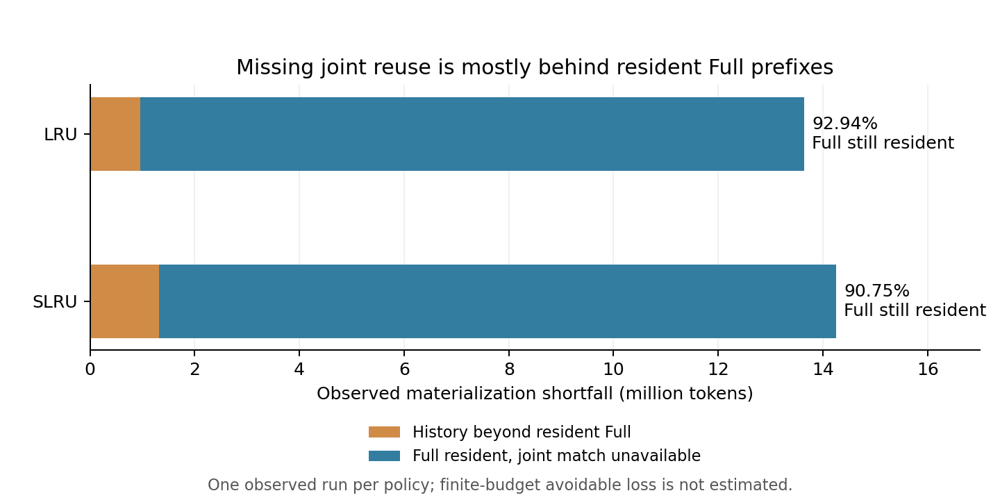

# 原生 Full/SWA 回收机制只读诊断

日期：2026-10-08。状态：两次 GPU 诊断、事件完整性审计与等容量局部反事实已完成；新策略尚未实施。

## 结论与下一步决策

**优先验证“可复用前沿”的统一管理机制。** 本轮定位到的关键缺口是：Full 前缀仍然驻留，但支撑联合匹配的末端 SWA 窗口被回收，使很长的前缀无法命中。LRU/SLRU 两次诊断中，这部分分别占观察缺口的 **92.94% / 90.75%**。这些比例描述当前不可用的缓存，不能直接当成有限容量策略能挽回的收益。

**确实存在不增加容量的局部改善机会，也存在明确反例。** 在预先选定的 `shock-analysis-demand` 第 70 轮，两次原生回放都只命中 3,072 token。通过保留一页窗口、在后续压力中逐次等量补偿释放，局部比较可命中 80,896 token，增加 77,824 token。在另一个合法替换中，替代对象先被请求，命中从 41,728 降到 3,072，损失 38,656 token。

因此，新机制应该围绕**哪些边界值得持续保留、如何在容量压力下撤销保护**设计。Full/SWA 使用同一复用单元、保护生命周期和安全回退规则。当前证据足以支持一次小规模机制验证，尚不足以预测整体命中率或 TTFT 提升。

超额释放、父节点暴露和池间级联确实存在，但它们本身不能证明“改回收粒度”就是主要收益来源。此前统一 Exposure Barrier 已完成适配和扩大测试；本轮发现不能被写成重新实施该机制的理由。

## 实验与审计边界

| 项目 | 设置 / 结果 |
|---|---|
| 流量 | 20 个完整 Agent session，1,206 请求/次；两次共 2,412 请求 |
| 原生对照 | LRU、SLRU 各一次；Full 使用所选评分，SWA 独立回收仍使用原生 LRU |
| 模型 / 引擎 | DeepSeek-V4-Flash；官方 SGLang 0.5.13.post1，UnifiedRadixCache，TP 8 |
| 容量 | Full 524,288 token；SWA 52,224 token；page 256；模型 SWA window 128 |
| 调度 | max running 8；原有完整工作负载与等待缩放 0.30 |
| 修改范围 | 全新官方 wheel 副本，只加只读日志；分类器、业务分区、Exposure Barrier 均关闭 |
| 正式测量范围 | LRU 从 flush 序号 1,745 之后；SLRU 从 1,744 之后；排除协议和 shape 预热 |
| 请求匹配覆盖 | 两次均 1,206/1,206；请求级统计使用最后一次 match |
| 匹配语义验证 | 正式原始 match 共 1,221 / 1,225 次；只读遍历与原生结果全部一致 |
| 客户端一致性 | 每次 1,206 条末次 match 与客户端 cached token 全部一致 |
| 事件 / 释放审计 | 事件序号连续；reclaim/drive 起止完整；component free、victim step、reclaim released 三者一致 |
| 完成 / 释放 | 两次均 1,206 条 finished commit；协议完整性通过；本实验 GPU 进程释放确认 |

观测副本去掉日志钩子后，三个被修改文件的 AST 与官方 wheel 一致；日志仅由 TP rank 0 写入。所有 token 数都是相应组件的逻辑计数，不除以 TP，也不转换为两池通用的物理字节。

观测开销会改变完成时刻及请求交错，所以本轮不是正式延迟排名。继续沿用[顺序互换复验](传统淘汰策略顺序互换复验_20261008.md)的结论：LRU/SLRU 平均命中率为 66.0260% / 65.9446%，没有稳定领先；保留 LRU 主基线。

## 将观察缺口拆开：已有 Full 丢失，还是联合窗口不可用

对同一个请求，使用三个已经观测到的量：

- `H`：自测量前 flush 以来，实际曾物化过的页历史所支持的联合前缀长度。
- `F`：请求到达时，真实树上仍驻留的连续 Full 前缀长度。
- `h`：原生联合匹配结果。

这里拆分 `H − h` 为两部分：`max(0, H − F)` 是历史参照超出当前驻留 Full 的部分；`min(H, F) − h` 是 Full 仍驻留、联合匹配却不可用的部分。所有正式末次匹配都满足 `H ≥ h`、`F ≥ h`。

| 请求级 token 统计 | LRU | SLRU |
|---|---:|---:|
| 原生匹配 `h` | 33,089,792 | 32,474,624 |
| 曾联合物化的历史参照 `H` | 46,727,680 | 46,727,680 |
| 观察缺口 `H − h` | 13,637,888 | 14,253,056 |
| 历史超出驻留 Full | 962,304 | 1,318,912 |
| Full 驻留而联合匹配不可用 | 12,675,584 | 12,934,144 |
| 后一项占观察缺口 | **92.94%** | **90.75%** |



该图表示诊断回放中缓存的可用性组成，不表示可避免重算或新策略总收益。[SVG](figures/mechanism_diagnosis_20261008/shortfall_decomposition.svg) / [PDF](figures/mechanism_diagnosis_20261008/shortfall_decomposition.pdf)。

进一步只检查真正阻塞最深联合匹配的缺失边界，而不是把所有历史 tombstone 都算成损失：

| 边界追溯 | LRU | SLRU |
|---|---:|---:|
| 有观察缺口的请求 | 461 | 486 |
| 有缺失驻留边界且能追溯真实 SWA free | 447 | 463 |
| 上述边界由 SWA 驱动回收 | 447 | 463 |
| 没有这种缺失驻留边界的请求 | 14 | 23 |
| 原始 SWA free 大小 p50 / p95 | 256 / 3,072 | 256 / 3,072 |
| free 到本次需求间隔 p50 | 9.48 秒 | 12.04 秒 |

447 / 463 个深端缺失边界全部能追溯到正式测量中的 SWA 回收，解释了表中 12,675,584 / 12,934,144 token 的驻留 Full 不可用部分。这是此次最强的机制证据；时间间隔仅用于描述，不用作预测工具时间或下一轮返回时间。

本模型的 window 128 小于 page 256。原生 validator 在 tombstone 后重新累计连续 SWA 长度；后面一个有 SWA 数据的完整页就能再次形成有效匹配边界。因此，旧历史中出现 tombstone 本来可能正常；重要的是靠近复用末端、能重新支撑联合命中的窗口是否还在。

## 预先选定的窗口复核

四个共同大缺口窗口均来自此前正式复验的选取清单；诊断没有删除其他请求。

| 任务 / 轮次 | 历史联合参照 | LRU：驻留 Full / 联合命中 | SLRU：驻留 Full / 联合命中 |
|---|---:|---:|---:|
| drone-planning-control / 63 | 121,088 | 120,832 / 0 | 120,576 / 3,072 |
| shock-analysis-supply / 62 | 93,184 | 93,184 / 0 | 93,184 / 3,072 |
| fix-build-agentops / 100 | 79,616 | 79,616 / 0 | 78,592 / 3,072 |
| shock-analysis-demand / 70 | 80,896 | 80,896 / 3,072 | 80,896 / 3,072 |

例如第一行，LRU 只缺少 256 token 的 Full，却无法联合命中剩余 120,832 token。仅查看 Full 驱逐 token 会漏掉这种损失。

按 session/turn 配对，两次各有 402 / 421 个请求的观察缺口至少 8,192 token，共有 392 个；对这 392 个共同大缺口取逐请求较小值并求和，为 **12,729,344 token**。对全部 1,206 个请求做同样求和是 12,975,360 token，两个口径不可混用。

另外四个预选正负向案例也保留：此前稳定偏向 SLRU 的两例，在此次诊断中两者都完整命中；此前偏向 LRU 的 `fix-erlang-ssh-cve / 49`、`setup-fuzzing-py / 33` 仍分别表现为 LRU 命中 33,024 / 23,296、SLRU 命中 0。它们仍受树状态和请求交错差异影响，不是单请求策略因果排名。

## 同状态、等容量替换：把另一条内容的代价一起算

离线比较从真实 `drive_begin` 的合法候选开始。保守地只交换两个**初始已合法、SWA 未锁定、非 device leaf、大小完全相同**的内部组件：保留原生准备回收的一个组件，回收另一个原生本轮没有释放的组件。其他 victim 不变，因此 Full 释放量不变，SWA 释放量相同；不借用额外容量，不假造父节点暴露或拆分。

Full 有锁、SWA 无锁的内部节点可以合法只释放 SWA；不能把这种候选称为非法。device leaf 原子删除会连带 Full，已排除在本保守交换中。

比较提供两种范围：

1. **单次交换。** 若替代内容后来也被原生回收、重新写入，或关联 Full 被释放，就结束比较。
2. **持续等量补偿。** 当后续原生 SWA 内部回收选到“替代方案中已经不存在的组件”，在同一回收轮选择另一个合法、等大小、原生未释放的内部组件补足。各轮结束时仍是“多留 N、少留 N”，Full/SWA 释放预算保持一致。

两种比较都在**第一次匹配结果改变**时停止，记录增加或减少的命中；若替代内容先产生损失，就先记负收益。无法保守重建的重新插入、关联 Full 变化、无合法补偿等情况会提前截断。插入日志中的旧祖先遍历不自动算重新物化：结合 `swa_evicted_seqlen` 排除已在窗口外、原生不会恢复的祖先。

这回答的是“在同一状态、同样预算下是否存在局部更好/更坏的选择”。后续命中改变带来的新插入、锁定、排序和调度反馈尚未模拟，所以它不是全程净收益或可部署策略的性能结果。

### 系统性抽样结果

每个有效 SWA drive，从原生本轮已选择的步骤中反向选最后一个存在合法等大小替代的内部 victim；替代对象固定选原始 LRU 列表中最早、原生未释放的等大小内部候选。该选择不用未来请求。各局部方案独立计算。

| 持续等量补偿比较 | LRU 轨迹 | SLRU 轨迹 |
|---|---:|---:|
| 有效 SWA drive | 3,000 | 2,940 |
| 有合法等大小方案 | 2,788 | 2,737 |
| 无合法等大小方案 | 212 | 203 |
| 首次改变匹配为正 | 88 | 65 |
| 首次改变匹配为负 | 6 | 7 |
| 提前截断或 trace 结束 | 2,694 | 2,665 |
| 正向方案涉及的去重请求 | 42 | 34 |
| 负向方案涉及的去重请求 | 1 | 6 |
| 正向局部增加 token 的 p50 | 16,128 | 20,480 |
| 负向局部损失 token 的最大值 | 38,656 | 3,072 |

166 个首次改变结果均对应原生请求的末次匹配。单次交换只获得 LRU 6 正 / 1 负、SLRU 5 正 / 6 负；持续保护需要处理后续压力，不是只把一次 victim 排序换一下就结束。

大量方案提前截断意味着本保守方法不能判断其后果，**不是证明收益为零**。同一请求也可能被多个独立方案影响，所以不能把局部增加量相加为全程收益，不能用这些计数计算策略胜率。

### 两次出现的正向案例：shock-analysis-demand / 70

| 局部窗口 | LRU 轨迹 | SLRU 轨迹 |
|---|---:|---:|
| 原生造成窗口缺失的 free 序号 | 14,229 | 15,152 |
| 初始可选等大小替代数 | 15 | 29 |
| 保留的 SWA 大小 | 256 token | 256 token |
| 后续同轮等量补偿次数 | 11 | 8 |
| 比较期间未改变匹配的请求访问 | 3 | 2 |
| 到首次改变匹配的实际间隔 | 6.13 秒 | 5.27 秒 |
| 首次改变匹配事件序号 | 14,596 | 15,441 |
| 原生联合命中 | 3,072 | 3,072 |
| 等容量替代后的联合命中 | 80,896 | 80,896 |
| 截止此次访问增加 / 减少 | +77,824 / 0 | +77,824 / 0 |

选择最早等大小替代即可得到该结果；其余初始替代也形成同样的局部改善。窗口定位用了事后日志，属于机会证明；不能据此宣称线上算法提前知道该请求何时返回。

这里持续补偿了所有已重建的回收需求，支撑窗口的一页没有免费保留。到第一次匹配改变前，没有观察到替代内容导致的更早命中损失；第一次改变后会影响新计算和调度，比较就结束。

其余三个预选大窗口均存在初始合法替代，但在目标回访前遇到本分析无法继续保守重建的重新插入，已标记截断，未算作成功。所有原先正负向窗口也保留在机器结果中，包括无等大小替代的情况。

### 负向案例：保护另一段历史，反而删掉了返回所需窗口

LRU 回收轮 220 的单次合法交换保住 25,856-token 边界附近的一页，改删 41,728-token 边界的一页。约 0.15 秒后，后一条内容先被请求，原生命中 41,728，而替代方案仅能命中 3,072，减少 **38,656 token**。这不是因为增加了容量、使用了非法候选或发生了额外 Full 回收；是被替代内容本身更有价值。

因此，不能给所有末端页永久保护，也不能仅因一页支撑很长 Full 就断言必有净收益。必须限制保护集合、考虑更新边界与容量回退，并在正式实验里统计两边代价。

## 真实回收与结构约束

下表只计正式测量事件。requested 是原生请求量，released 是实际组件释放逻辑 token；额外量包括整节点释放和跨池附带释放。

| 策略 / 池 | 请求释放 | 实际释放 | 超额释放 | 超额 / 请求 |
|---|---:|---:|---:|---:|
| LRU / Full | 1,593,036 | 3,057,664 | 1,464,628 | 91.94% |
| LRU / SWA | 11,988,412 | 15,845,632 | 3,857,220 | 32.17% |
| SLRU / Full | 1,972,194 | 3,428,608 | 1,456,414 | 73.85% |
| SLRU / SWA | 11,893,264 | 16,460,288 | 4,567,024 | 38.40% |

| 结构证据 | LRU | SLRU |
|---|---:|---:|
| reclaim 次数 | 3,396 | 3,447 |
| Full victim step | 2,722 | 3,239 |
| 之后暴露父候选的 Full step | 2,323（85.34%） | 2,758（85.15%） |
| 同一 Full drive 下一步立即选择刚暴露父节点 | 1,558 | 1,476 |
| SWA victim step | 16,747 | 13,577 |
| Full 活跃候选数 p50 / p95 | 23 / 55 | 8 / 15 |
| SWA 活跃候选数 p50 / p95 | 48 / 78.05 | 36 / 66 |

父节点追踪按同一池的实际 event 序列进行，不将两池各自从 1 开始的 step 混排。SLRU 另有一次在本轮稍后选择暴露父节点，故“本轮最终选中”是 1,477，立即选中仍为 1,476。

| 驱动回收的池 → 实际释放组件 | LRU | SLRU |
|---|---:|---:|
| SWA → SWA | 15,838,720 | 16,215,296 |
| SWA → Full | 253,696 | 158,720 |
| Full → Full | 2,803,968 | 3,269,888 |
| Full → SWA | 6,912 | 244,992 |

这些结果用于确认实现必须处理叶约束、锁、原子删除和级联。回收超额的比例与请求级命中缺口不是同一种量，不能由前者推导后者的主要成因。

## 下一步最小机制与验收

以下是候选设计，未实施、未测收益：

1. **维护有限的可复用前沿。** 以实际 token 前缀和 namespace 识别链及分叉，记录当前有效联合边界、对应 Full 前缀和必要末端窗口。首次请求、真实续接和最新写入来自线上事件；不预测工具时间或返回时间。输入边界与新生成尾部要区分，不能把尚未有复用证据的生成分支自动长期保护。
2. **统一管理保护生命周期。** 在预算内保住前沿需要的窗口；出现新的有效续接边界时替换旧边界。Full 已消失、保护预算用尽或没有足够合法候选时撤销保护并走 LRU 安全回退。Full/SWA 使用同一保护集合，底层分别执行合法物理回收。
3. **先验证机制，再扩大规模。** 小规模只比较 LRU 与启用上述机制，固定工作负载、两池容量和生成配置；同时计保护页、补偿释放、回退、被替代内容的重算，以及 Full 驻留却无法联合复用的缺口。通过后回到完整 20 会话，做顺序互换与重复运行，报告命中、prefill 处理量、TTFT、队列和请求耗时。

核心验收是：缺失窗口导致的长前缀损失下降，且被替代内容造成的损失更小。若只能救少数窗口或时间没有改善，就明确降低该机制优先级。不能把此次 90% 以上的诊断组成比例当成目标提升幅度。

## 可复查文件与复现

- [紧凑机器报告](原生回收机制只读诊断_20261008.json)
- [聚合与审计结果](../results/analysis/mechanism_diagnosis_20261008/summary.json)
- [完整局部反事实](../results/analysis/mechanism_diagnosis_20261008/local_counterfactual.json)
- [完整诊断批次](../results/mechanism/20261008T071917Z_ce85885f/)
- [观测器](../scripts/mechanism_observer.py)、[隔离准备](../scripts/prepare_mechanism_observer.py)、[诊断编排](../scripts/run_mechanism_diagnosis.py)
- [事件分析](../scripts/analyze_mechanism_diagnosis.py)、[等量替换分析](../scripts/analyze_mechanism_counterfactual.py)、[绘图](../scripts/plot_mechanism_diagnosis.py)
- [官方副本观测锁](../runtime/mechanism_overlay_20261008/observation.lock.json)
- [分析测试](../tests/test_mechanism_analysis.py)、[观测和官方 AST 一致性测试](../tests/test_mechanism_observer.py)

验证：16 项观测/分析测试与 14 项原有实验编排测试通过；新增 Python 编译检查、`git diff --check`、机器结果来源哈希和报告链接检查通过。图由独立分析用 Python 的 Matplotlib 生成，没有向已有推理环境安装依赖。

在项目根目录执行事件分析和局部反事实；后者的 `--model-config` 指向本实验引用模型的只读 `config.json`，其中 `sliding_window` 已核对为 128，机器报告保存该文件哈希。

```bash
python3 experiments/evicition_policy/scripts/analyze_mechanism_diagnosis.py --suite experiments/evicition_policy/results/mechanism/20261008T071917Z_ce85885f --output experiments/evicition_policy/results/analysis/mechanism_diagnosis_20261008/summary.json
python3 experiments/evicition_policy/scripts/analyze_mechanism_counterfactual.py --suite experiments/evicition_policy/results/mechanism/20261008T071917Z_ce85885f --model-config /path/to/model/config.json --output experiments/evicition_policy/results/analysis/mechanism_diagnosis_20261008/local_counterfactual.json
python3 experiments/evicition_policy/scripts/plot_mechanism_diagnosis.py --summary experiments/evicition_policy/results/analysis/mechanism_diagnosis_20261008/summary.json --output experiments/evicition_policy/reports/figures/mechanism_diagnosis_20261008/shortfall_decomposition
```

## 解释限制

历史参照仅保留实际曾物化的页元数据，不是满足有限容量的最优缓存；它与原生 validator 的节点边界口径也有区别。当前树的 node validator 已对全部正式匹配验证正确；这不把历史参照升级成精确可避免重算量。

局部比较冻结之后的原生事件，遇到首次匹配变化或不能保持合法预算的状态变化即停止。它不会给出完整新策略的后续调度、锁和插入结果；截断方案保留为未判断。正式新策略必须重新服务验证。

本工作负载按上轮实际完成后等待的规则发送下一条历史输入，但下一条输入仍来自固定轨迹；每次 1,186 个历史续接检查中，仅 2 个与本次生成完全一致。因此它是固定历史内容的服务回放，不是用新输出驱动真实工具的完整 Agent 闭环。这一限制同样适用于此前基线。

报告保留聚合量、页哈希和事件位置；原始 prompt、输出、环境、模型文件和大日志仅保留本地。此次没有 commit、push 或远端上传。
