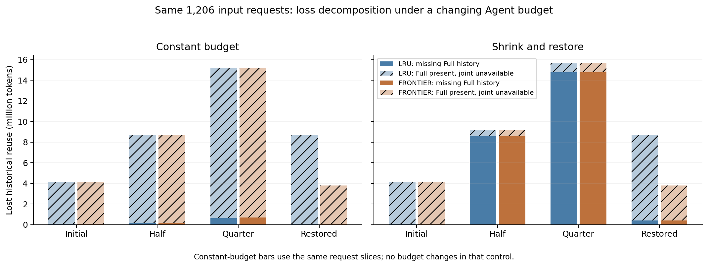
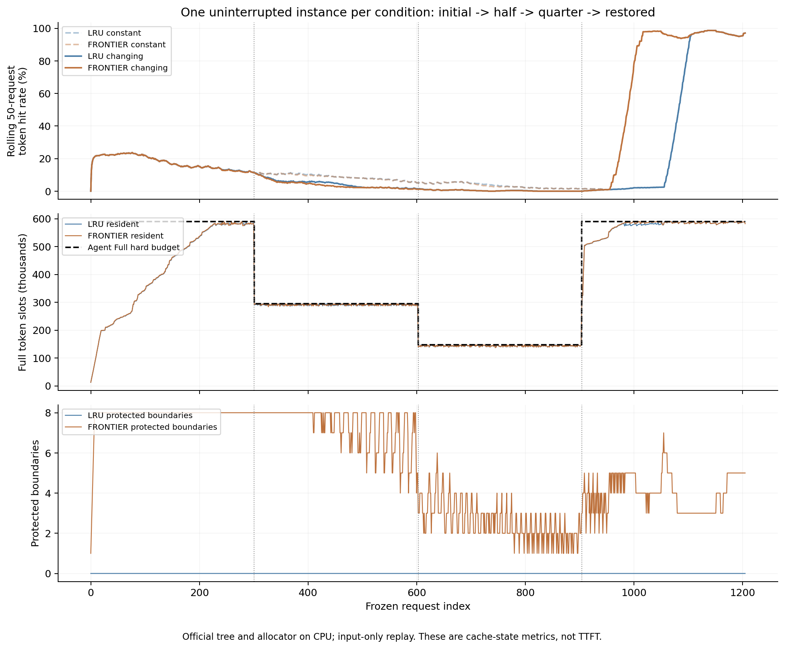

# 变容量 Agent 缓存机制验证与 Insight

日期：2026-10-09。阶段：初步机制验证已完成；GPU 时延与混合流量组合尚未验证。

**结论：当前机制能够正确执行运行中的容量收缩，但还没有表现出收缩阶段的性能优势。** 全程约 +9.89 个百分点的命中收益全部来自后段，恒定容量对照同样出现这一收益。真正需要解决的问题是：容量变小时，保护资格能否穿过其他请求的竞争，保留下次可实际复用的完整边界。

## 1. 完成了什么

新增 [预算执行层](../scripts/resizable_agent_budget.py)和[官方缓存重放入口](../scripts/replay_resizable_native.py)。预算执行层接收上层给定的硬额度与版本，分配前检查空间，在插入、完成与解锁后再次执行预算；保护限额随硬预算裁剪，受保护候选阻挡合法回收时仍按原 v1 规则撤销资格、继续原生 LRU。扩容只允许后续插入使用更多空间，已经释放的数据不会自动恢复。

Full/SWA 使用同一套依赖保护和撤销机制，分别记录物理占用、原生锁、合法候选与真实释放。物理占用来自 allocator 的总量减可用量，包含尚未进入缓存树的在途页；不能用撤销保护的依赖量冒充真实释放。软边界更新本身不强制 free。

本轮使用独立、未经修改的官方 UnifiedRadixCache 包，在新建实例上安装冻结 v1 的保护 hooks。实际调用官方 Full/SWA 组件、请求索引池和分页分配器，执行匹配、分块提交、引用锁迁移与索引页 free。CPU backing 没有模型 KV 张量内容和推理计算，因此这是实际缓存控制路径验证，不能报告 TTFT 或线上吞吐。

35 项检查通过：17 项预算执行层、7 项官方缓存微型重放、11 项冻结保护机制检查。微型验收覆盖连续缩容、零保护额度、锁定欠量与解锁重试、扩容不复活数据、SWA 依赖缺失和过大请求拒绝。正式四组每个请求均通过缓存结构、预算、索引页所有权和实际释放审计。两种新增边界拆分计数全为零，本轮差异不能归因于新增拆分。

## 2. 冻结实验协议

使用相同的完整 20 会话、1,206 个输入请求，每组 48,787,785 个输入 token；总计 4,824 请求。来源、输入哈希、顺序与预算在运行前冻结，未按结果调整事件或选择容量。

| 项目 | 本轮设置 |
|---|---|
| 两种策略 | 原生 LRU；有限预算可复用输入边界保护 v1，简称保护版本 |
| 两种容量轨迹 | 恒定 C0；C0 → C0/2 → C0/4 → C0 |
| 初始物理容量 Full / SWA | 589,824 / 52,224 token slots |
| 最小硬预算 Full / SWA | 147,456 / 13,056 token slots |
| 页、SWA 窗口、prefill 分块 | 256 / 128 / 8,192 token |
| v1 保护上限 | 最多 8 单元、去重 Full 依赖 262,144、SWA 依赖 4,096；随硬预算裁剪 |
| 请求顺序 | 按清单中会话顺序串行轮询，保留每会话 turn 顺序 |
| 状态连续性 | 每个条件内部不重建实例、不清空缓存；条件间独立实例 |

本轮 C0 与此前 GPU 的 Full 524,288 不同：最大完整输入为 135,896 token，页分配工作集为 135,936，旧容量的四分之一 131,072 无法准入全部输入。因此使用 589,824，使四分之一仍能装下单个完整输入。这是准入选择，未依据收益调参。

| 请求区间，零基索引 [起点, 终点) | 阶段 | 变容量 Full / SWA 硬预算 |
|---|---|---:|
| [0, 301) | 初始 | 589,824 / 52,224 |
| [301, 603) | 半容量 | 294,912 / 26,112 |
| [603, 904) | 四分之一容量 | 147,456 / 13,056 |
| [904, 1206) | 恢复 | 589,824 / 52,224 |

恒定容量条件使用完全相同的请求区间作诊断切片，实际预算始终不变。切换点只是受控实验事件，不是线上动态分区的触发规则。轮询没有自然工具等待、并发请求或 decode；与此前 GPU 回放的绝对命中率不可直接横比。

## 3. 全程平均掩盖了什么

| 条件 | token 加权命中率 | 容量损失 token | Full 历史已缺失 | Full 驻留但联合不可用 |
|---|---:|---:|---:|---:|
| 恒定 LRU | 20.4353% | 36,756,992 | 958,208 | 35,798,784 |
| 恒定保护 | 30.3913% | 31,899,648 | 971,264 | 30,928,384 |
| 变容量 LRU | 18.6030% | 37,650,944 | 23,838,464 | 13,812,480 |
| 变容量保护 | 28.4961% | 32,824,320 | 23,814,656 | 9,009,664 |

恒定容量净新增命中 4,857,344 token（+9.9561 个百分点）；变容量净新增命中 4,826,624 token（+9.8931 个百分点）。变容量中 95 请求改善、25 请求退化，正收益 4,903,424 token、负收益 76,800 token，已将改善与退化同时计入全程净收益；这不是逐单元替代损失的因果归因。

无限历史索引只保存本协议实际计算并物化过的输入页，使用相同的前缀查询、页对齐和命名空间。四组历史可复用量均为 46,726,912 token，输入中新内容及查询/对齐不能命中的部分共 2,060,873 token。这里的“容量损失”是历史参照与实际命中之差，不是有限容量最优算法差距，也不能全部叫错误淘汰。

损失按以下恒等式分解：

`历史可复用 − 实际命中 = 历史可复用 − Full 驻留前缀 + Full 驻留前缀 − Full/SWA 联合可用前缀`。

第二项说明联合可用依赖缺口，不能仅凭这一数值判定 SWA 的淘汰排序错误，也不能据此把 Full/SWA 拆成两种策略。

变容量逐阶段结果：

| 阶段 | 请求数 | LRU 命中率 | 保护命中率 | 保护 − LRU，百分点 |
|---|---:|---:|---:|---:|
| 初始 | 301 | 15.7721% | 15.7194% | −0.0527 |
| 半容量 | 302 | 3.4931% | 2.8439% | −0.6492 |
| 四分之一容量 | 301 | 0.2089% | 0.1900% | −0.0190 |
| 恢复 | 302 | 46.1415% | 75.1993% | +29.0577 |

**前三段没有任何请求获得正收益，所有改善都在最后 302 请求。** 恒定容量相同前三段也分别退化 0.0527 / 0.1236 / 0.1520 个百分点；后段同样提高 29.0577 个百分点。恢复阶段每个请求的实际命中，均与相同策略的恒定容量对照一致，包括恢复后 20/60/120/302 请求窗口。

因此，本轮没有观测到相对恒定容量的后段命中恢复惩罚，也不能把后段收益归为扩容适配的独有效果。恢复前后实际保留的 Full 历史仍有差别，而联合命中相同，说明仅保住 Full 数据未必带来有效命中。变容量相对恒定容量的全程命中下降分别为 LRU 1.8323、保护版本 1.8953 个百分点，当前机制没有体现更强的抗缩容能力。

时间线中的驻留是请求完成后的状态，不是 prefill 峰值；命中曲线是最近 50 请求的 token 加权值，不是时间指标。恒定容量后段曲线与变容量重合。

## 4. 收缩是否真正交还了空间

两种策略的两次收缩均在一次原生 evict 调用内完成，欠量为零。正式切换位于串行请求之间，没有在途引用锁；锁定欠量与解锁重试由微型验收覆盖，不能写成正式并发测试已经完成。

| 策略、切换 | 需要释放 Full / SWA | 实际释放 Full / SWA | 释放后驻留 Full / SWA | 欠量 |
|---|---:|---:|---:|---:|
| LRU → 半容量 | 287,488 / 24,832 | 290,816 / 24,832 | 291,584 / 26,112 | 0 |
| 保护 → 半容量 | 284,928 / 22,528 | 286,720 / 22,784 | 293,120 / 25,856 | 0 |
| LRU → 四分之一 | 145,408 / 9,472 | 152,064 / 16,384 | 140,800 / 6,144 | 0 |
| 保护 → 四分之一 | 146,688 / 10,752 | 153,088 / 17,408 | 141,056 / 6,400 | 0 |

超额与跨池释放来自原生回收粒度和连带释放，已核对 allocator 的真实占用下降。扩容事件不释放页，也没有复活已释放内容。

全程淘汰量在分析中将请求内部回收与预算切换回收分开后相加；自然完成、窗口裁剪和尾页释放不列为淘汰。变容量 LRU 全程 Full/SWA 淘汰量为 25,155,584 / 39,506,176，保护版本为 25,139,200 / 34,679,040 token。较少的 SWA 淘汰仍不能替代分阶段联合命中结论。

## 5. 机制线索：资格没有撑到回访

### 5.1 容量变小时，主要瓶颈转移了

半容量和四分之一容量中，LRU 与保护版本的 Full 历史缺失数完全相同：8,569,856 / 14,760,960 token。这两项占保护版本容量损失的 93.00% / 94.29%；恒定容量同区间仅占 1.76% / 4.48%。

这意味着固定容量时主要面对“Full 在、联合依赖不完整”，收缩后主要面对“Full 前提已经消失”。保护完整边界仍是正确的依赖对象，但现有保护分配方式没有改变两段 Full 历史损失。在这种状态下，仅延长末端窗口存活无法保住整个可复用前缀。

### 5.2 每个新边界都有资格，但资格周转太快

当前 v1 每个完整输入边界物化时都会准入保护，本轮均在 prefill 提交阶段；超出保护预算或被回收压力阻挡时撤销最旧资格。四分之一容量阶段平均只剩 2.538 个保护单元，范围 1–6；226/301 请求（75.08%）发生 Full 压力撤销，总计撤销 301 个单元。预算切换额外撤销 3 个单元，与请求内部计数分开。

半容量有 22/302 请求触发 Full 压力撤销，共 34 单元。前三段精确祖先边界替换计数均为零；这说明旧资格未能保留到观测到的资格迁移，不意味着历史 token 没有重复。

离线按原轨迹 session 描述交错：四分之一阶段与同 session 前次请求的间距中位数为 9，保护单元平均仅 2.538。即使恒定容量同区间平均保留 4.831 单元，仍没有精确祖先替换。因此收缩加重了问题，原有 8 单元/262K 限额与多链轮转本身也有问题。

最后阶段间距中位数降到 4，出现 189 次精确祖先资格替换，两条容量轨迹完全一致。189 次均位于间距不超过 5 的请求；间距 6–8 的 82 个请求没有替换。该相关性支持继续检查“资格先于回访被撤销”，但没有逐单元日志能直接重建全部资格寿命，不能当作完整因果证明。

这里的 session、剩余轨迹长度和间距只用于离线解释。剩余轨迹变少不等于服务端知道任务结束；session 间距也不等于实际 token 前缀复用，不能把它直接加入线上策略。

## 6. 对下一版策略的启示

优先研究一个最小机制：**保护资格的有限准入与保留，抵抗连续新输入造成的资格轮换。** 新请求可以正常计算和进入缓存，但不必每次都把已有保护资格挤掉。借鉴传统缓存中的 probation/protected 分段：限制新边界对保护段的替换，精确续接证据仍来自实际 token 祖先关系，不使用 session 或返回时间预测。

这也解释了为什么不能照搬“第二次访问就保护所有节点”：Agent 的历史 token 普遍重复，关键是当前缓存中哪些完整边界值得占用有限资格，以及资格能否跨过竞争。下一轮应只改准入/保留规则，保持原生回收顺序与预算执行层一致，记录每个单元的准入、迁移、撤销原因、依赖是否实际驻留和之后的复用，并比较保留它造成的其他损失。

第二个待检验方向是收缩时的保护粒度：能否保留较浅、较便宜但依赖完整的边界，将较新的长尾让给原生回收。较浅边界必须有真实、仍驻留的 SWA 窗口；只剩 Full 祖先或元数据不能生成可用 checkpoint。应先审计有哪些合法浅边界，再决定是否实现，避免为了增加边界数制造虚假命中。

第三个工程约束是当前请求的工作空间。四分之一容量时保护 Full 上限可等于全部硬预算，实际新请求到来仍须让出空间，容易迫使保护撤销。应检查准入后的完整依赖和当前分配需求能否共存，不把“限额按比例裁剪”本身当作性能策略，也不预设一个新的固定比例最优。

下一轮验收优先看半容量与四分之一容量的净容量损失、退化请求和完整边界存活；继续保留恒定轨迹控制，避免只用全程平均值评估适配。首版机制通过后再做 GPU 时延和混合流量共同后端验证，分别比较“同一动态分区 + LRU”与“同一动态分区 + 新 Agent 策略”。当前结果不能证明所有传统策略或论文方法在动态分区下失效。

## 7. 明确未完成的范围

- 当前是 Agent-only 实例范围的官方 adapter；混合流量需要分区归属占用与严格 scoped 候选适配。默认 adapter 会拒绝有限范围，不能用整个缓存释放量冒充 Agent 归还量。
- 预算执行必须在调度线程串行、allocator free group 之外运行；本轮没有完成真实服务调度器与反馈分区控制器接线。
- 正式四组仅使用硬预算，显式 `release=0`。显式借用归还债务目前只扣 evict 回调观测到的真实 free；外部自然完成或窗口裁剪 free 尚无通知扣债契约。该限制不影响本轮硬预算结果，混合借用组合前必须补齐。
- 没有模型计算、decode、真实工具等待、TTFT、ITL、GPU 吞吐或并发归还完成时间。复查时 8 张 H800 每卡仅余约 15.8–16.2 GiB，低于此前 TP8 权重本身约 24.49 GB/卡的需求，未启动新 GPU 服务，也未触及其他任务。
- 只验证这一完整输入集合、合成强交错和一条收缩恢复轨迹。缓存控制是实际官方路径，流量时序仍是受控协议；性能泛化尚需更多负载与真实 serving 验证。

## 8. 复查入口

- [冻结协议](../configs/resizable_native_probe_v1.json)、[完整 suite](../results/resizable_native/20261008T155100Z_v1/suite.json)、[实际执行源码归档](../results/resizable_native/20261008T155100Z_v1/executed_sources/manifest.json)。
- [分析汇总](../results/analysis/resizable_native_20261009/summary.json)、[逐请求配对](../results/analysis/resizable_native_20261009/paired_requests.csv)、[阶段指标](../results/analysis/resizable_native_20261009/phase_metrics.csv)、[行为诊断](../results/analysis/resizable_native_20261009/behavior_diagnostic.json)。
- [35 项检查回执](../results/resizable_native/cpu_audit_20261008T154849Z_f3f319/test_receipt.json)、[紧凑机器结果](变容量Agent缓存机制验证与Insight_20261009.json)。
- 分析入口：[analyze_resizable_native.py](../scripts/analyze_resizable_native.py)；图表入口：[plot_resizable_native.py](../scripts/plot_resizable_native.py)。分析和图表输出均使用新目录，保留原测量记录。图同时提供 PNG、SVG、PDF。

测量源码与测试回执的三个实现哈希一致；suite、协议和逐条件输入/事件/结果哈希已交叉核对。代码、官方来源与结果指纹见 suite 及归档 manifest。没有创建 git commit、push 或上传。
