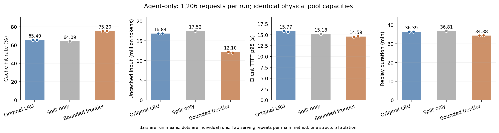
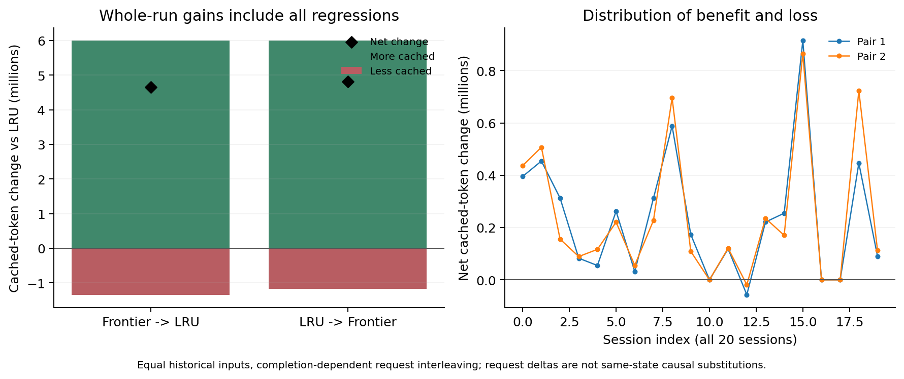

# 可复用边界保护 v1：完整验证

完成时间（UTC）：2026-10-08T14:47:44.094101+00:00。状态：5 次完整 GPU 运行已结束，共 6,030 个请求，完整性、同容量、输出数量、缓存清空及自有服务释放审计通过。

**相对完全原生 LRU，保护版本平均命中率提高 9.7113 个百分点，未命中输入量变化 -28.14%，平均 TTFT 变化 -18.73%，TTFT p95 变化 -7.46%。** 两种顺序中均提高了总体缓存命中，值得保留机制并继续做容量与混合流量验证。此处未命中输入包含必要新内容，不能全称为淘汰重算；两次重复是描述性证据，不是显著性检验。

## 实验边界

纯 Agent-only，完整 20 会话 / 1,206 请求，模型 DeepSeek-V4-Flash、官方 SGLang 0.5.13.post1、UnifiedRadixCache、TP8、8 张 H800。Full 524,288 token、SWA 52,224 token，page 256、窗口 128，最大并发 8、chunked prefill 8,192；等待和启动间隔使用原冻结的 0.30 缩放。每次输入 48,787,785 token、生成 693,217 token，策略之间重启服务。分类器、业务分区、旧 Exposure Barrier 均关闭。

原生基线是从固定 SHA256 的官方 wheel 新解出的完全未经修改副本。保护和结构消融使用同一个单独副本；没有覆盖已有 venv、项目引擎或历史结果。最初启动在正式测量前由控制器中断，用于进一步排除既有环境中的关闭状态历史补丁，0 个测量请求，不计入结果。

保护对象是实际输入的可复用边界：连续 Full 祖先和匹配必需的末端 SWA 窗口，共用同一个单元。同一精确前缀链出现新边界就替换旧边界；最多 8 个单元、去重 Full 依赖上限 262,144、SWA 依赖上限 4,096。超限撤销最旧保护；没有未保护合法候选时，撤销阻挡候选的最旧单元并回退 LRU。两池仅在物理候选/锁/释放适配上不同，没有两套策略，也没有工具时间预测。详细设计见 [设计与验收](可复用边界保护_v1设计与验收.md)。

## 五次运行与重复

| 顺序 | 机制 | 命中率 | 未命中输入（百万） | TTFT 均值（秒） | TTFT p95（秒） | 请求耗时 p95（秒） | 测量时长（分钟） |
|---:|---|---:|---:|---:|---:|---:|---:|
| 1 | 有限边界保护 | 75.0005% | 12.197 | 3.796 | 14.532 | 38.490 | 34.34 |
| 2 | 完全原生 LRU | 65.4580% | 16.852 | 4.758 | 15.892 | 43.664 | 36.40 |
| 3 | 只登记/拆分，关闭保护 | 64.0884% | 17.520 | 4.705 | 15.184 | 46.827 | 36.81 |
| 4 | 完全原生 LRU | 65.5173% | 16.823 | 4.691 | 15.641 | 45.625 | 36.37 |
| 5 | 有限边界保护 | 75.3972% | 12.003 | 3.883 | 14.650 | 38.588 | 34.42 |

两个主要策略均值：LRU 65.4876%，保护 75.1989%。平均请求耗时变化 -12.18%，p95 变化 -13.68%；完整回放时长变化 -5.51%。此处策略分位数均值是“两次运行各自分位数再取均值”，不是合并两轮请求的分位数。由于会话等待保留，回放时长不等于无等待吞吐。

| 对照顺序 | 净新增命中 token | 新增命中请求 / 下降请求 | 新增 / 损失 token | 命中提升（百分点） |
|---|---:|---:|---:|---:|
| 有限边界保护 → 完全原生 LRU | 4,655,616 | 263 / 82 | 5,996,288 / 1,340,672 | 9.5426 |
| 完全原生 LRU → 有限边界保护 | 4,820,224 | 254 / 73 | 5,993,984 / 1,173,760 | 9.8800 |

两次对照中均增加命中的请求有 167 个，均下降的有 20 个。所有下降请求都已计入净收益。相同输入的配对仍包含完成时间改变造成的交错变化，因此不能把每个负差直接叫“保护造成的替代损失”。此前同状态、等量释放的正负局部反事实仍保留在原生诊断报告中。

## 结构与保护审计

| 运行 | 登记 / prefill 登记 | 额外拆分 | 最大单元 / Full 依赖 / SWA 依赖 | 预算撤销 | 压力撤销 Full / SWA |
|---|---:|---:|---:|---:|---:|
| 01_bounded_frontier | 1206 / 1206 | 0 | 8 / 262,144 / 2,048 | 438 | 7 / 0 |
| 03_split_only | 0 / 1206 | 0 | 0 / 0 / 0 | 0 | 0 / 0 |
| 05_bounded_frontier | 1206 / 1206 | 0 | 8 / 262,144 / 2,048 | 447 | 8 / 0 |

**本数据没有触发任何新增边界拆分。** 官方 prefill 缓存路径已经隔出输入末端和所需页尾部；只拆分消融实际成为“登记检查、关闭保护”的控制。因此不能解释为“拆分有害”，也不能把保护版本的收益归因于新增拆分。后续跨引擎/输入边界验证仍要检查拆分的独立影响。

保护日志仅由 rank 0 写出，序列连续且没有超预算。保护版本记录的两池实际 free 与官方聚合计数除以 TP8 后完全一致。输入边界来自实际缓存提交，未读未来请求；所有正式请求在 prefill 阶段已登记。官方引用锁、原子叶回收与容量分配继续生效。

## 时间为什么没有按命中率等比例改善

| 机制 | 客户端 TTFT 均值 | rank 0 队列均值 | 两者均值之差 | 记录回收时间（各 rank 平均） | 回收调用（各 rank 平均） |
|---|---:|---:|---:|---:|---:|
| 完全原生 LRU | 4.724 秒 | 3.926 秒 | 0.798 秒 | 64.89 秒 | 3506.5 |
| 只登记/拆分，关闭保护 | 4.705 秒 | 3.883 秒 | 0.821 秒 | 64.99 秒 | 3628.0 |
| 有限边界保护 | 3.839 秒 | 3.170 秒 | 0.670 秒 | 104.86 秒 | 2877.5 |

**TTFT 中位数没有稳定改善。** p50 两轮变化分别为 -10.71% / 22.50%，两次指标均值由 0.491 秒变为 0.503 秒（2.45%）。第二轮 TTFT p99 变化 1.90%。当前明确复现的是总体命中、未命中输入、平均 TTFT、TTFT p95 和请求耗时改善，p50/p99 尚不稳定。

队列直方图每个 TP rank 的覆盖均核对为完整 1,206 请求，不叠加副本。TTFT 减平均队列时间后的数值同时含 prefill、首 token、传输和其他前端开销，不是孤立 GPU prefill；也不能用 p95 减另一个分布的 p95。保护减少未命中工作后，队列和请求交错都可能变化，因此 decode 阶段观测变化也不能宣称来自新的 decode 算法。

v1 用树依赖重算和候选跳过实现，正式回收计时包含这些成本。这个数字用于定位工程开销，不是把八张卡的回收时间累加到服务时长。下一版可优先减少重复依赖遍历，保持机制和对照配置一致。

## 验证范围与下一步

本轮支持在该 Agent-only 压力点继续研究统一可复用边界保护；尚未证明所有容量、其他 Agent 流量或动态分区组合下都有效。下一步先做相邻压力容量点的对照，再回到混合流量/动态分区组合。保留完全原生 LRU 和当前版本作为冻结参照；不要同时堆加新的预测和评分机制。

五次测量期间 DeepGEMM JIT 提示数依次为 [13, 13, 13, 13, 13]。提示条数不是实际编译成本；当前时间结果保留这些事件，仍需进一步统一预热或计时验证。实际请求重调度次数依次为 [0, 0, 0, 0, 0]；监控容量记账残差采样次数依次为 [0, 1, 0, 0, 0]，瞬时 scrape 残差保留在明细中。

下一轮输入仍来自历史轨迹，等待上一轮实际完成后再按原记录缩放等待；新生成通常不等于历史回答。该结果不是执行真实工具的 Agent 闭环。本版本只保护实际输入边界，没有自动保护当前新生成尾部；真实闭环仍需专门验证。

## 复现与证据

- 完整运行：`results/frontier/20261008T110644Z_ddfff9c3/suite.json`；分析：`results/analysis/frontier_validation_20261008/summary.json`，同目录保留逐请求与会话配对 CSV。
- [机器结果](可复用边界保护_v1完整验证_20261008.json)；[冻结配置](../configs/bounded_frontier_v1.json)；[实现](../scripts/bounded_frontier.py)；[运行入口](../scripts/run_frontier_validation.py)；[分析入口](../scripts/analyze_frontier_validation.py)。
- 新机制 11 项 CPU 检查、21 项回放回归检查通过；官方节点拆分与锁 UUID 释放已通过 CPU 检查，GPU 完整性和所有自有服务释放审计通过。
- 原始输入、输出、环境、权重和大日志仅保留本地。本报告和紧凑 JSON 不包含原始请求文本或输出。未执行 git commit/push。

分析文件 SHA256：`f934eee52d64cf0133be9a0038391671d5e5115c01927aa53b7eb0665d0864f6`。
保护副本 lock SHA256：`880bf46fddd96ff487b1323881f9b792b7767c95a6c38af6bc4cf35e445dec5c`。
纯净原生副本 lock SHA256：`dd64db3921237c6bdfd4e482300cfd3cb633f058ba104a8435d5c87235146de3`。
