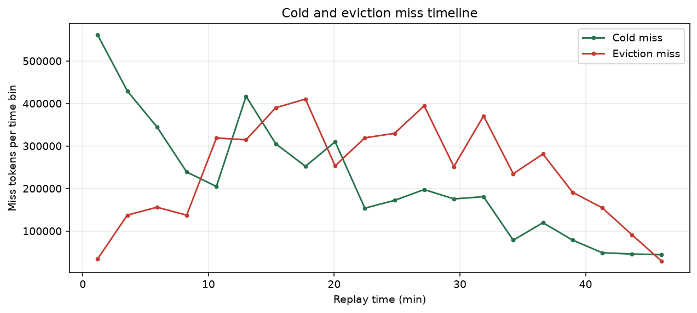
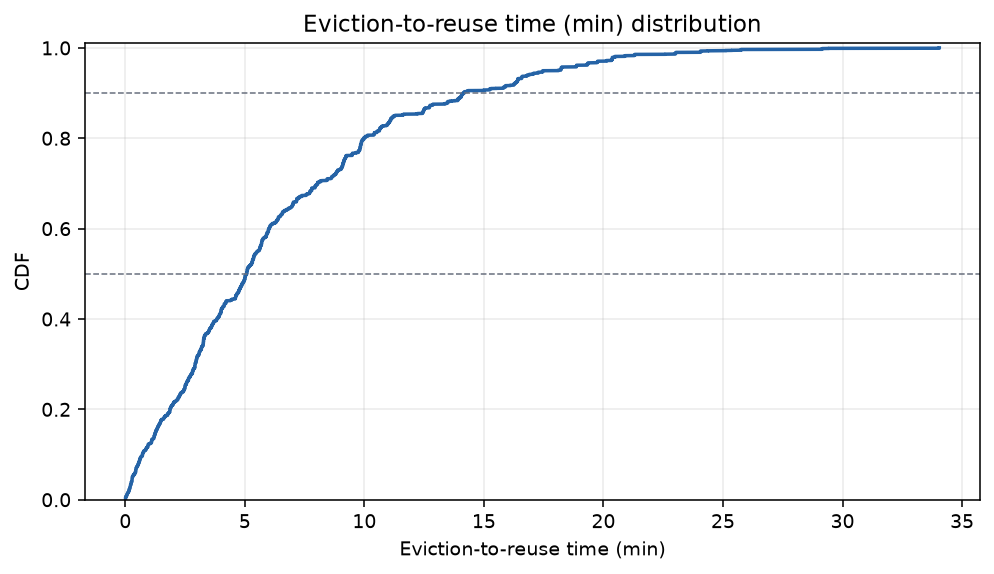
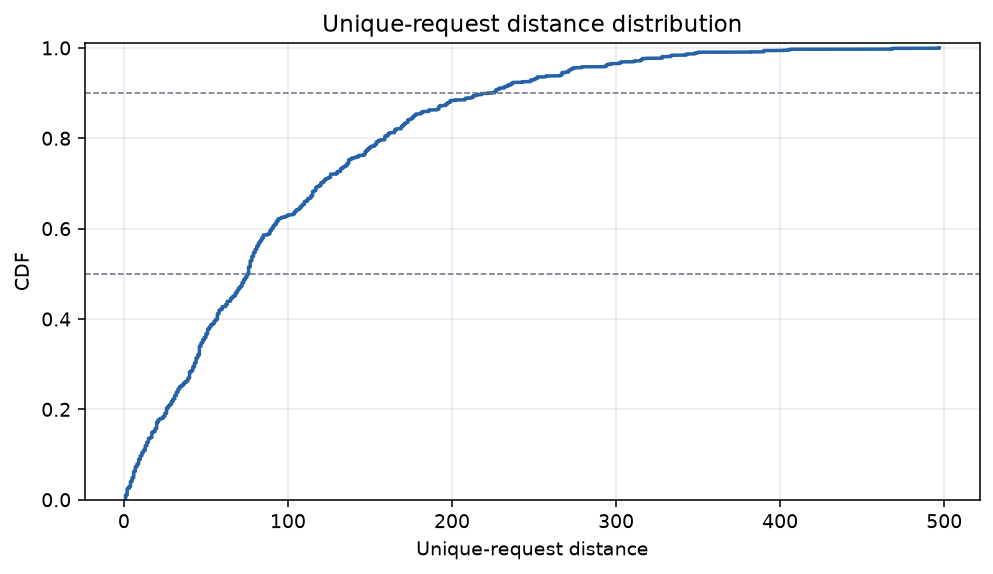
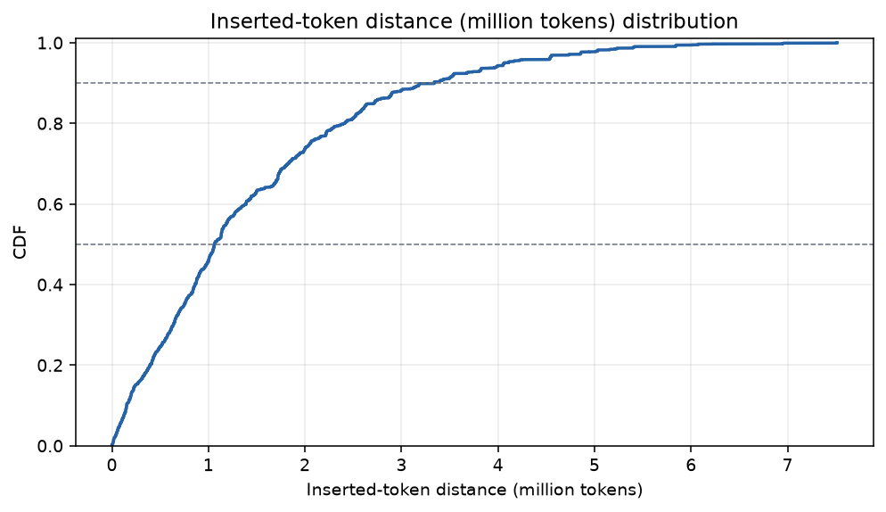
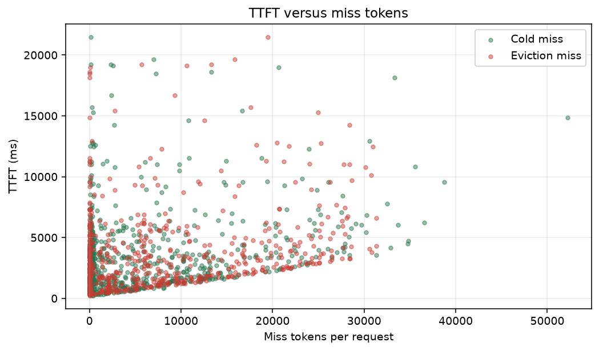

# GLM KV diagnostic experiment report

## Summary

- successful replay requests: **620 / 620**
- client token-weighted hit ratio: **34.53%**
- page-aligned diagnostic hit ratio: **34.58%**
- eviction miss: **4,799,104 tokens**, **52.41% of all miss tokens**
- cold miss: **4,357,888 tokens**, **47.59% of all miss tokens**
- requests with eviction miss: **456 / 620**
- eviction reuse time p50 / p90: **304.63 / 849.49 s**
- reuse request distance p50 / p90: **76.00 / 224.00**
- inserted-token distance p50 / p90: **1062912.00 / 3339328.00**

## Replay quality

- wall clock: **3600.094 s**; errors: **0**

| latency | p50 (ms) | p90 (ms) | p99 (ms) | mean (ms) |
|---|---:|---:|---:|---:|
| TTFT | 2789.36 | 7449.32 | 18562.33 | 3726.11 |
| TPOT | 26.34 | 74.02 | 212.69 | 40.93 |
| E2E | 6713.09 | 20205.45 | 44124.57 | 9736.00 |

- client cached / prompt tokens: **4,840,448 / 14,017,429**
- scheduling drift p50 / p90: **1.09 / 4.24 ms**
- throughput: **0.1722 req/s**, **24.4555 output tok/s**

## Native baseline comparison

Baseline: experiments/sglang_kv_cache/glm_online_replay/v4flash_vanilla/run_glm_openloop_20260801_053834.summary.json

| metric | diagnostic | native baseline | delta |
|---|---:|---:|---:|
| n_ok | 620.000000 | 620.000000 | 0.000000 |
| ttft_p50_ms | 2789.362000 | 2702.774000 | 86.588000 |
| ttft_p90_ms | 7449.320300 | 7425.755100 | 23.565200 |
| ttft_p99_ms | 18562.330460 | 18519.910790 | 42.419670 |
| ttft_mean_ms | 3726.106574 | 3680.150332 | 45.956242 |
| token_weighted_hit | 0.345316 | 0.346919 | -0.001603 |
| req_per_s | 0.172200 | 0.172200 | 0.000000 |

## Miss attribution

| miss class | tokens | share of miss |
|---|---:|---:|
| cold | 4,357,888 | 47.59% |
| eviction | 4,799,104 | 52.41% |
| other | 0 | 0.00% |

| quarter | request range | cold tokens | eviction tokens | eviction share of miss | requests with eviction |
|---:|---:|---:|---:|---:|---:|
| Q1 | 1-155 | 1,618,112 | 571,904 | 26.11% | 73 / 155 |
| Q2 | 156-310 | 1,087,104 | 1,297,664 | 54.41% | 118 / 155 |
| Q3 | 311-465 | 928,128 | 1,444,224 | 60.88% | 129 / 155 |
| Q4 | 466-620 | 724,544 | 1,485,312 | 67.21% | 136 / 155 |

## Eviction reuse distributions

- page observations: **74,986**
- time p50 / p90: **304.63 / 849.49 s**
- request distance p50 / p90: **76.00 / 224.00**
- inserted-token distance p50 / p90: **1062912.00 / 3339328.00 tokens**

## Latency relationship

- TTFT vs eviction-miss-token correlation: **0.2574**
- TTFT vs total-miss-token correlation: **0.4574**

## Diagnostics integrity

- selected PID: **1661977**
- unique / raw request rows: **620 / 773**
- ignored rematches / non-target rows: **152 / 1**
- request-result join: **620 matched**
