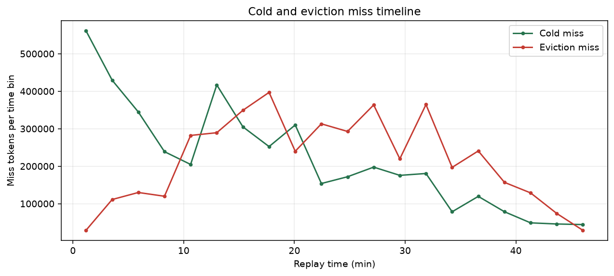
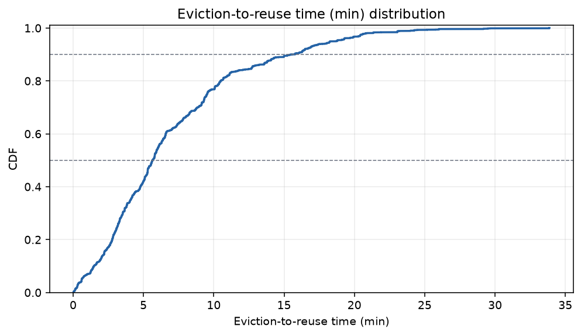
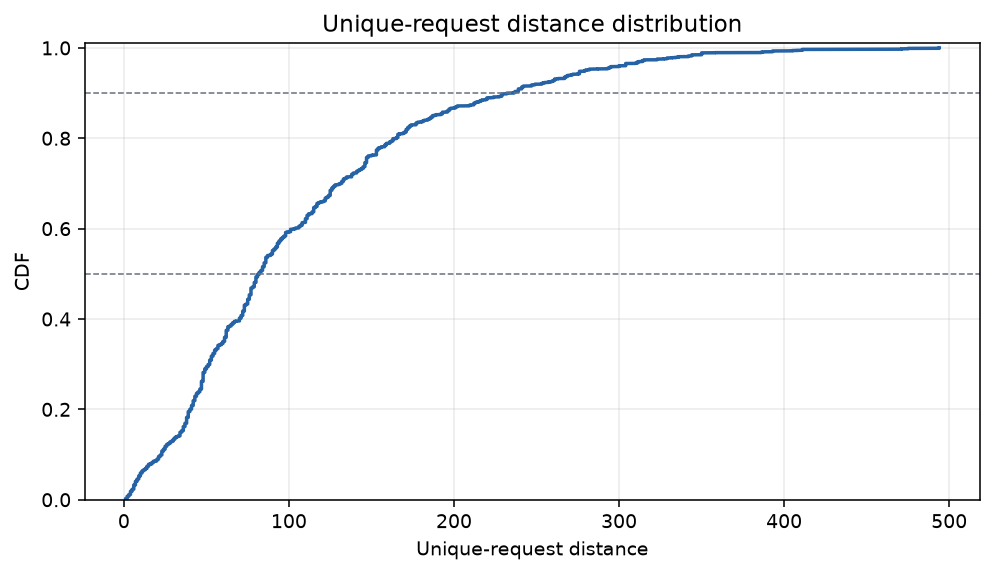
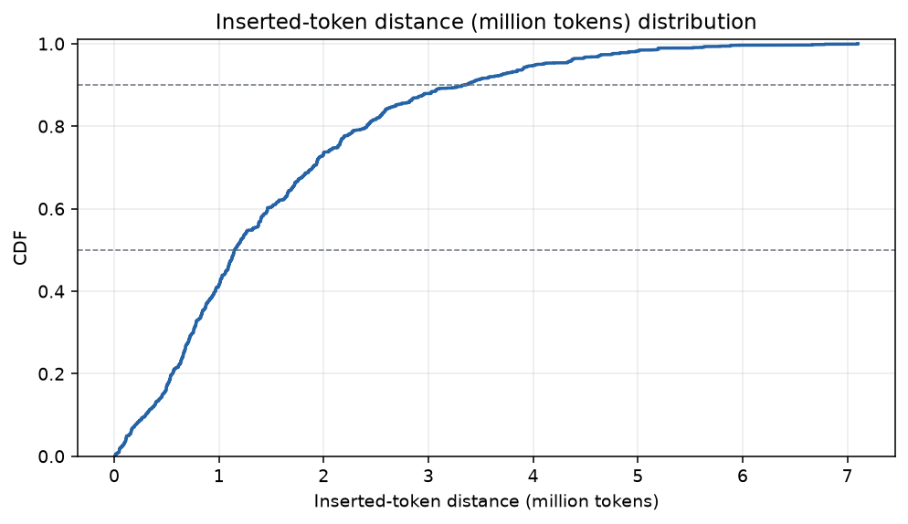
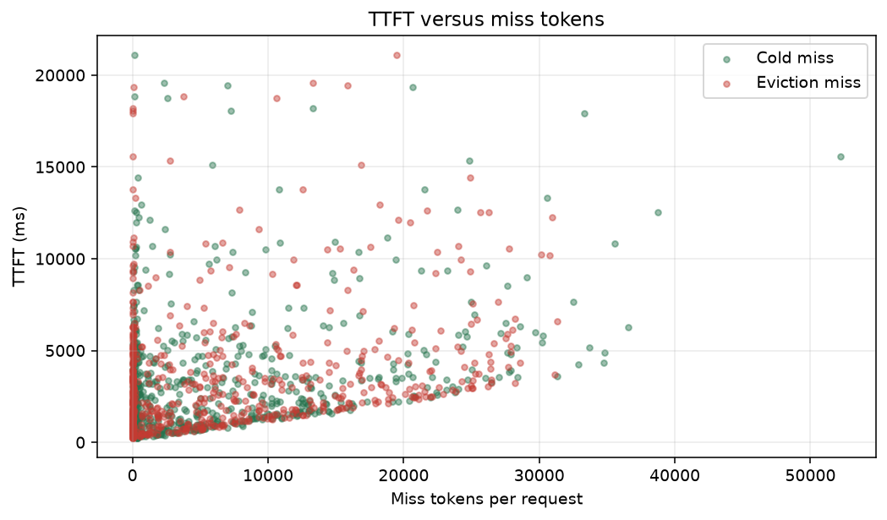

# GLM KV diagnostic experiment report

## Summary

- successful replay requests: **620 / 620**
- client token-weighted hit ratio: **37.85%**
- page-aligned diagnostic hit ratio: **37.96%**
- eviction miss: **4,326,784 tokens**, **49.82% of all miss tokens**
- cold miss: **4,357,440 tokens**, **50.18% of all miss tokens**
- requests with eviction miss: **426 / 620**
- eviction reuse time p50 / p90: **338.20 / 932.75 s**
- reuse request distance p50 / p90: **82.00 / 236.00**
- inserted-token distance p50 / p90: **1148160.00 / 3337472.00**

## Replay quality

- wall clock: **3600.048 s**; errors: **0**

| latency | p50 (ms) | p90 (ms) | p99 (ms) | mean (ms) |
|---|---:|---:|---:|---:|
| TTFT | 2587.83 | 7639.40 | 18186.98 | 3581.46 |
| TPOT | 25.15 | 69.48 | 165.17 | 38.35 |
| E2E | 6384.51 | 20332.45 | 40666.37 | 9256.32 |

- client cached / prompt tokens: **5,306,048 / 14,017,429**
- scheduling drift p50 / p90: **1.09 / 5.11 ms**
- throughput: **0.1722 req/s**, **24.0744 output tok/s**

## Native baseline comparison

Baseline: /share/dai-sys/zhoulongsheng/agentkv/experiments/sglang_kv_cache/glm_online_replay/v4flash_vanilla/run_glm_openloop_20260801_053834.summary.json

| metric | diagnostic | native baseline | delta |
|---|---:|---:|---:|
| n_ok | 620.000000 | 620.000000 | 0.000000 |
| ttft_p50_ms | 2587.829000 | 2702.774000 | -114.945000 |
| ttft_p90_ms | 7639.404700 | 7425.755100 | 213.649600 |
| ttft_p99_ms | 18186.981430 | 18519.910790 | -332.929360 |
| ttft_mean_ms | 3581.455655 | 3680.150332 | -98.694677 |
| token_weighted_hit | 0.378532 | 0.346919 | 0.031613 |
| req_per_s | 0.172200 | 0.172200 | 0.000000 |

## Miss attribution

| miss class | tokens | share of miss |
|---|---:|---:|
| cold | 4,357,440 | 50.18% |
| eviction | 4,326,784 | 49.82% |
| other | 0 | 0.00% |

| quarter | request range | cold tokens | eviction tokens | eviction share of miss | requests with eviction |
|---:|---:|---:|---:|---:|---:|
| Q1 | 1-155 | 1,618,112 | 486,592 | 23.12% | 72 / 155 |
| Q2 | 156-310 | 1,086,976 | 1,191,488 | 52.29% | 109 / 155 |
| Q3 | 311-465 | 928,064 | 1,354,176 | 59.34% | 121 / 155 |
| Q4 | 466-620 | 724,288 | 1,294,528 | 64.12% | 124 / 155 |

## Eviction reuse distributions

- page observations: **67,606**
- time p50 / p90: **338.20 / 932.75 s**
- request distance p50 / p90: **82.00 / 236.00**
- inserted-token distance p50 / p90: **1148160.00 / 3337472.00 tokens**

## Latency relationship

- TTFT vs eviction-miss-token correlation: **0.2716**
- TTFT vs total-miss-token correlation: **0.4970**

## Diagnostics integrity

- selected PID: **1758407**
- unique / raw request rows: **620 / 760**
- ignored rematches / non-target rows: **139 / 1**
- request-result join: **620 matched**
